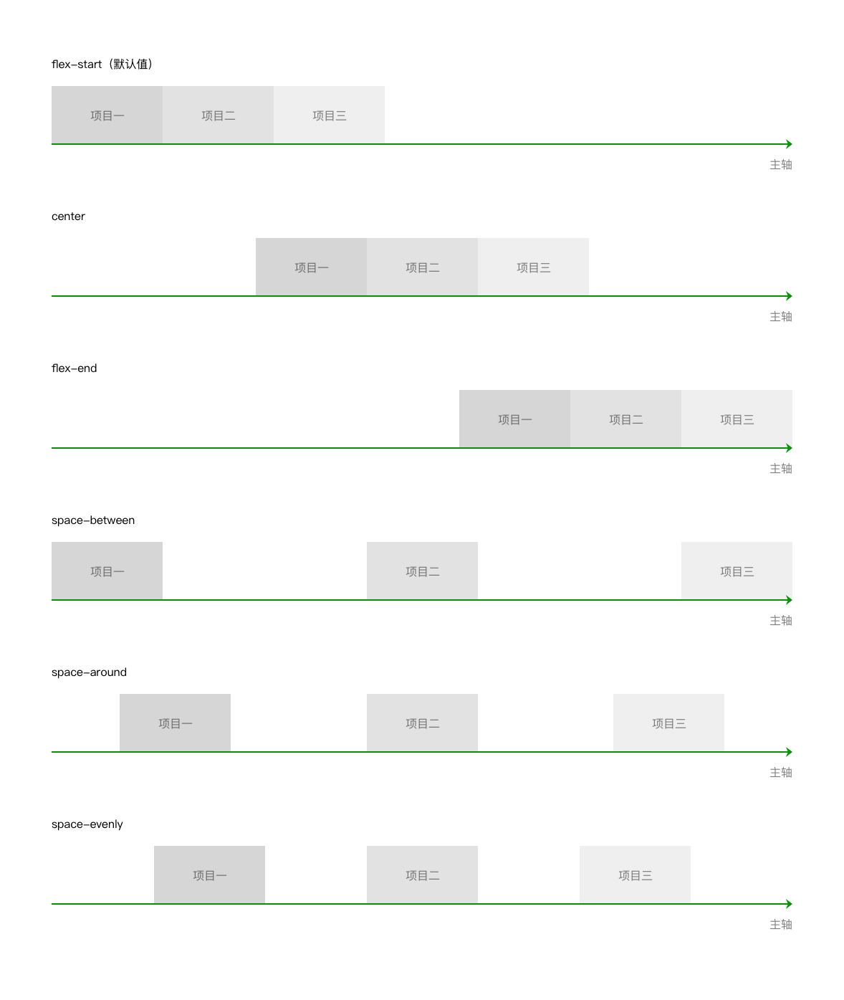
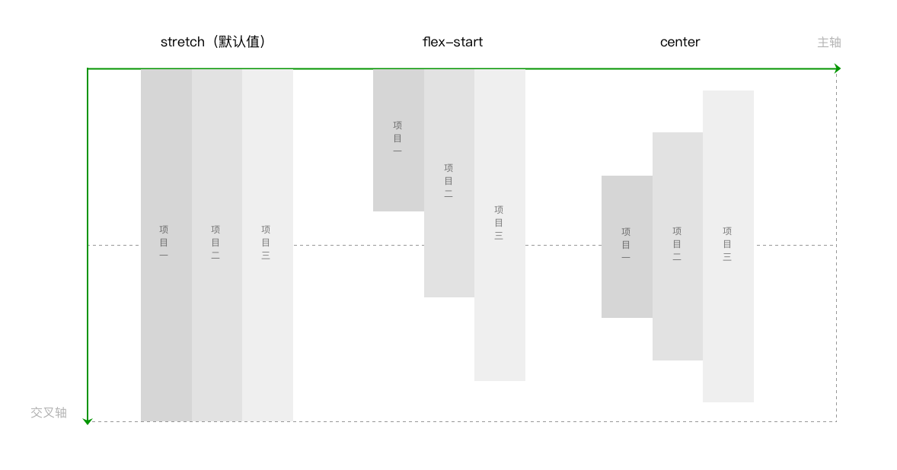
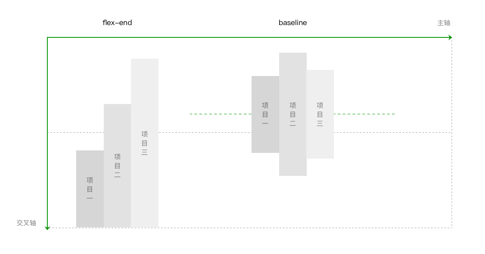
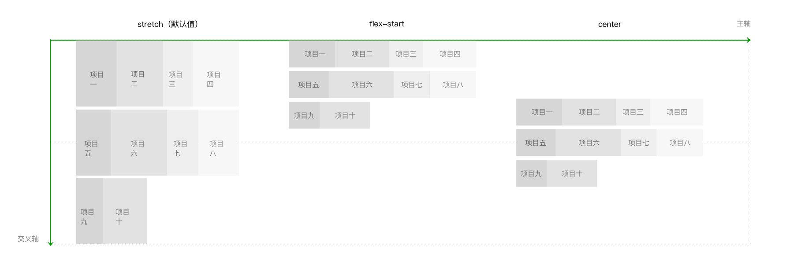
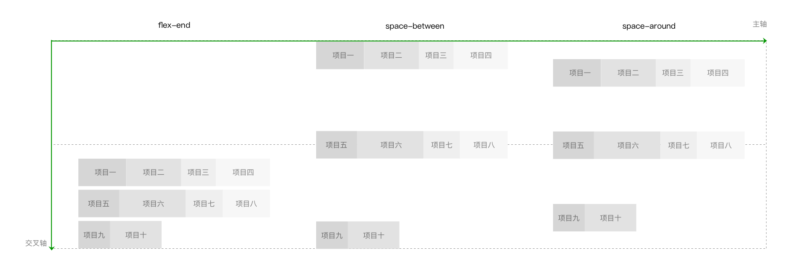
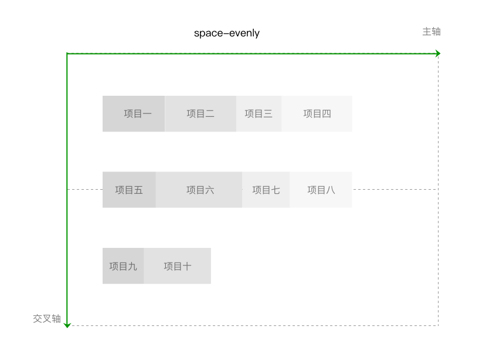

[微信小程序flex讲解](https://developers.weixin.qq.com/ebook?action=get_post_info&docid=00080e799303986b0086e605f5680a)
[flex布局中妙用margin: auto](https://juejin.im/post/5bde54ce51882516e840a8af)
[探秘 flex 上下文中神奇的自动 margin](https://www.cnblogs.com/coco1s/archive/2019/05/23/10910588.html)


# Flex 布局是什么？

Flex 是 Flexible Box 的缩写，意为"弹性布局"，用来为盒状模型提供最大的灵活性。

任何一个容器都可以指定为 Flex 布局。行内元素也可以使用 Flex 布局。

```
.box{
  display: flex;
}
```


## 基本概念

采用 Flex 布局的元素，称为 Flex 容器（flex container），简称"容器"。

它的所有子元素自动成为容器成员，称为 Flex 项目（flex item），简称"项目"。

容器默认存在两根轴：坐标轴

默认的情况下，水平方向的是主轴（main axis），垂直方向的是交叉轴（cross axis）。

项目是在主轴上排列，排满后在交叉轴方向换行。需要注意的是，交叉轴垂直于主轴，它的方向取决于主轴方向。

单个项目占据的主轴空间叫做main size，占据的交叉轴空间叫做cross size

```语法
	flex: flex-grow flex-shrink flex-basis|auto|initial|inherit;
```


# 属性
```
	// 父容器的属性，用于统一管理容器内项目布局，也就是管理项目的排列方式和对齐方式。
	display:flex 		使用flex弹性布局
	flex-direction		通过设置坐标轴，来设置项目排列方向。
	flex-wrap			设置是否允许项目多行排列，以及多行排列时换行的方向。
	flex-flow			是flex-direction 和 flex-wrap 的简写形式
	justify-content		设置项目在主轴方向上对齐方式，以及分配项目之间及其周围多余的空间。
	align-items			设置项目在行中的对齐方式。
	align-content 		多行排列时，设置行在交叉轴方向上的对齐方式，以及分配行之间及其周围多余的空间。

	// 子项目的属性，设置项目的尺寸、位置，以及对项目的对齐方式做特殊设置。
	order				主轴方向上的排列顺序,用整数值来定义排列顺序，数值小的排在前面。可以为负值
	flex-grow			当项目在主轴方向上还有剩余空间时，通过设置项目扩张因子进行剩余空间的分配。默认为0，即如果存在剩余空间，也不放大。
	flex-shrink			当项目在主轴方向上溢出时，通过设置项目收缩因子来压缩项目适应容器。默认为1，即如果空间不足，该项目将缩小
	flex-basis			定义了在分配多余空间之前，项目占据的主轴空间。flex-basis优先级高于width，它的默认值为auto，即项目的本来大小
	flex 				是flex-grow，flex-shrink，flex-basis的简写方式。后两个属性可选。默认值为0 1 auto。值设置为none，等价于0 0 auto。值设置为auto，等价于1 1 auto。
	align-self			设置项目在行中交叉轴方向上的对齐方式，用于覆盖容器的align-items，这么做可以对项目的对齐方式做特殊处理。默认值为auto，表示继承父元素的align-items属性
	margin				设置"margin"值为"auto"值，自动获取弹性容器中剩余的空间
```

## flex-direction

通过设置坐标轴，来设置项目排列方向。

[ row（默认值） | row-reverse | column |column-reverse ]

- row： 			主轴横向，x轴，方向为从左指向右。项目沿主轴排列，从左到右排列。。
- row-reverse：		反转横向排列,row的反方向。主轴横向，方向为从右指向左。项目沿主轴排列，从右到左排列
- column： 			主轴纵向，y轴排列。方向从上指向下。项目沿主轴排列，从上到下排列。
- column-reverse：	反转纵向排列，column的反方向。主轴纵向，方向从下指向上。项目沿主轴排列，从下到上排列。


##	flex-wrap			

设置是否允许项目多行排列，以及多行排列时换行的方向。

[ nowrap（默认值） | wrap | wrap-reverse ] 

- nowrap		默认，不换行。如果单行内容过多，则溢出容器。
- wrap 			容器单行容不下所有项目时，换行排列。
- wrap-reverse	容器单行容不下所有项目时，换行排列。换行方向为wrap时的反方向。


## flex-flow

是flex-direction 和 flex-wrap 的简写形式

.box {
  flex-flow: <flex-direction> || <flex-wrap>;
}


## justify-content		

设置项目在主轴方向上对齐方式，以及分配项目之间及其周围多余的空间。

[ flex-start（默认值） | flex-end | center |space-between | space-around | space-evenly ] 

- flex-start		项目对齐主轴起点，项目间不留空隙。
- flex-end			弹性项目向行尾紧挨着填充
- center			项目在主轴上居中排列，项目间不留空隙。主轴上第一个项目离主轴起点距离等于最后一个项目离主轴终点距离。（如果剩余的自由空间是负的，则弹性项目将在两个方向上同时溢出)
- space-between		项目间间距相等，第一个项目离主轴起点和最后一个项目离主轴终点距离为0
- space-around		与space-between相似。不同点为，第一个项目离主轴起点和最后一个项目离主轴终点距离为中间项目间间距的一半。
- space-evenly		项目间间距、第一个项目离主轴起点和最后一个项目离主轴终点距离等于项目间间距。




## align-items			

设置项目在行中的对齐方式。

[ stretch（默认值） | center  | flex-end | baseline | flex-start ]
 
- stretch		项目拉伸至填满行高
- flex-start	项目顶部与行起点对齐
- flex-end		项目底部与行终点对齐
- center 		项目在行中居中对齐
- baseline		项目的第一行文字的基线对齐






##	align-content

多行排列时，设置行在交叉轴方向上的对齐方式，以及分配行之间及其周围多余的空间。

[ stretch（默认值） | flex-start | center |flex-end | space-between | space-around | space-evenly ] 

- stretch 		 当未设置项目尺寸，将各行中的项目拉伸至填满交叉轴。当设置了项目尺寸，项目尺寸不变，项目行拉伸至填满交叉轴。
- flex-start 	 首行在交叉轴起点开始排列，行间不留间距。
- flex-end 		 尾行在交叉轴终点开始排列，行间不留间距。
- center 		 行在交叉轴中点排列，行间不留间距，首行离交叉轴起点和尾行离交叉轴终点距离相等。
- space-between  行与行间距相等，首行离交叉轴起点和尾行离交叉轴终点距离为0。
- space-around   行与行间距相等，首行离交叉轴起点和尾行离交叉轴终点距离为行与行间间距的一半。
- space-evenly	 行间间距、以及首行离交叉轴起点和尾行离交叉轴终点距离相等。







## order

排序,用整数值来定义排列顺序，数值小的排在前面。可以为负值
```
	item:first {order:-1}
```


## flex-grow		

当项目在主轴方向上还有剩余空间时，通过设置项目扩张因子进行剩余空间的分配。属性值为项目的扩张因子，属性值取非负数。

默认为0，即如果存在剩余空间，也不放大。

```
	.item {
	  flex-grow: <number>; /* default 0 */
	}
```

如果所有项目的flex-grow属性都为1，则它们将等分剩余空间（如果有的话）。
如果一个项目的flex-grow属性为2，其他项目都为1，则前者占据的剩余空间将比其他项多一倍。

为了加深理解，我们举个例子：

一个宽度为400px的容器，里面的三个项目width分别为80px，120px，140px。分别对这项目1和项目2设置flex-grow值为3和1。

```
.container{
  display: flex;
  width: 400px; // 容器宽度为400px
}

.item1{
  width: 80px;
  flex-grow: 3;
}

.item2{
  width: 120px;
  flex-grow: 1;
}

.item3{// 项目3未设置flex-grow，默认flex-grow值为0
  width: 140px;
}
```

在这个例子中，容器的剩余空间为 400 - (80 + 120 + 140) = 60px。剩余空间按 60 / (3 + 1 + 0) = 15px进行分配：

item1的最终宽度为：80+ (15 * 3) = 125px
item2的最终宽度为：120 + (15 * 1) = 135px
item3的最终宽度为：140 + (15 * 0) =140px


##	flex-shrink		

当项目在主轴方向上溢出时，通过设置项目收缩因子来压缩项目适应容器。属性值为项目的收缩因子，属性值取非负数。

```
	.item {
	  flex-shrink: <number>; /* default 1 */
	}

```

如果所有项目的flex-shrink属性都为1，当空间不足时，都将等比例缩小。如果一个项目的flex-shrink属性为0，其他项目都为1，则空间不足时，前者不缩小。

负值对该属性无效。

为了加深理解，我们举个例子：

一个宽度为400px的容器，里面的三个项目width分别为120px，150px，180px。分别对这项目1和项目2设置flex-shrink值为2和3。

```
.container{
  display: flex;
  width: 400px; // 容器宽度为400px
}
```

在这个例子中，项目溢出 400 - (120 + 150 + 180) = -50px。计算压缩量时总权重为各个项目的宽度乘以flex-shrink的总和，这个例子压缩总权重为120 * 2 + 150 * 3+ 180 * 1 = 870。各个项目压缩空间大小为总溢出空间乘以项目宽度乘以flex-shrink除以总权重：

item1的最终宽度为：120 - 50 * 120 * 2 / 870 ≈ 106px

item2的最终宽度为：150 - 50 * 150 * 3 / 870 ≈ 124px

item3的最终宽度为：180 - 50 * 180 * 1 / 870 ≈ 169px

其中计算时候值如果为小数，则向下取整。


## flex-basis		

flex-basis属性定义了在分配多余空间之前，项目占据的主轴空间（mainsize）

浏览器根据这个属性，计算主轴是否有多余空间。它的默认值为auto，即项目的本来大小

当容器设置flex-direction为row或row-reverse时，flex-basis和width同时存在，flex-basis优先级高于width，也就是此时flex-basis代替项目的width属性。

当容器设置flex-direction为column或column-reverse时，flex-basis和height同时存在，flex-basis优先级高于height，也就是此时flex-basis代替项目的height属性。

需要注意的是，当flex-basis和width（或height），其中一个属性值为auto时，非auto的优先级更高。

```
	.item {
	  flex-basis: <length> | auto; /* default auto */
	}
```


## flex 

flex属性是flex-grow, flex-shrink 和 flex-basis的简写，默认值为0 1 auto。后两个属性可选。

[ none | auto | @flex-grow @flex-shrink@flex-basis ]
  
- auto: 			值为 1 1 auto
- none：			值为 0 0 auto
- flex-grow			定义弹性盒子元素的扩展比率。
- [ flex-shrink ]	定义弹性盒子元素的收缩比率。
- [ flex-basis ]	定义弹性盒子元素的默认基准值。

```
	.item {
	  flex: none | [ <'flex-grow'> <'flex-shrink'>? || <'flex-basis'> ]
	}

```

该属性有两个快捷值：auto (1 1 auto) 和 none (0 0 auto)。


## align-self		

设置项目在行中交叉轴方向上的对齐方式，用于覆盖容器的align-items，这么做可以对项目的对齐方式做特殊处理。

默认值为auto，继承容器的align-items值，当容器没有设置align-items时，属性值为stretch

[ auto（默认值） | flex-start | center | flex-end | baseline |stretch ]


# flex 中的 margin 有很大的妙用

[flex布局中妙用margin: auto](https://juejin.im/post/5bde54ce51882516e840a8af)
[探秘 flex 上下文中神奇的自动 margin](https://www.cnblogs.com/coco1s/archive/2019/05/23/10910588.html)

设置"margin"值为"auto"值，自动获取弹性容器中剩余的空间。

所以设置垂直方向margin值为"auto"，可以使弹性子元素在弹性容器的两上轴方向都完全集中。

可以通过这个特性实现完美居中：

```
	<style> 
	.flex-container {
	    display: flex;
	    width: 400px;
	    height: 250px;
	    background-color: lightgrey;
	}

	.flex-item {
	    background-color: cornflowerblue;
	    width: 75px;
	    height: 75px;
	    margin: auto;
	}
	</style>

	<div class="flex-container">
	  <div class="flex-item">Perfect centering!</div>
	</div>

```


## 兼容

注意: Internet Explorer 9 及更早版本不支持 flex 属性。

注意: Internet Explorer 10 通过 -ms-flex 属性来支持。 IE11 及更新版本完全支持 flex 属性 (不需要 -ms- 前缀)。

注意: Safari 6.1 (及更新浏览器) 通过 -webkit-flex 属性支持。

注意，设为 Flex 布局以后，子元素的float、clear和vertical-align属性将失效

兼容不是很大的问题，如非要兼容低版本浏览器，无非就是加个垫片的事情