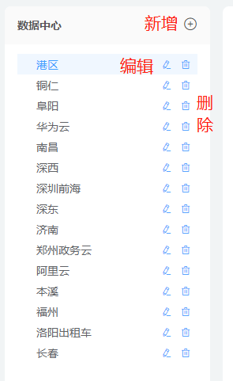
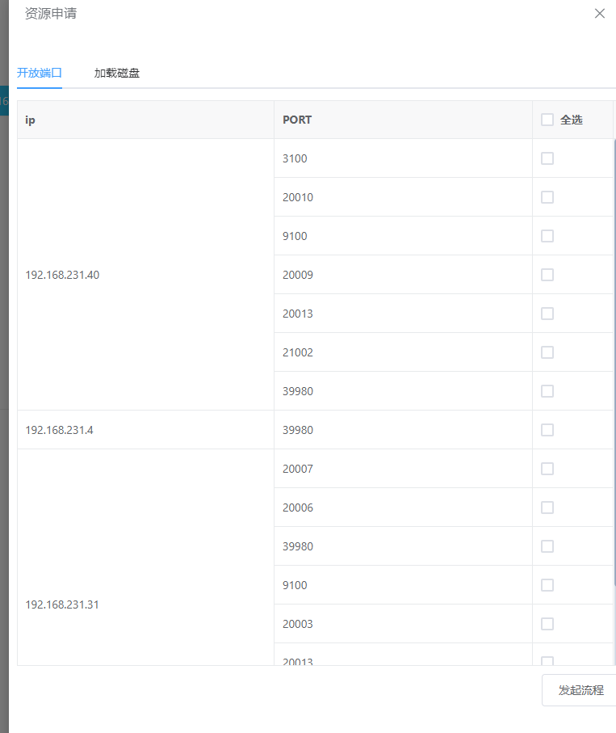
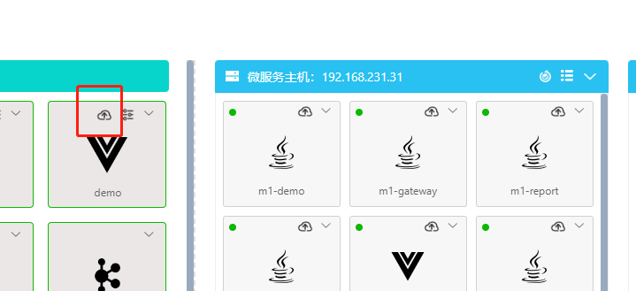

# `@tiamaes/cbb-deploy` 使用手册
> 文档基于版本 `0.0.13`

## 指南

### 介绍

该组件是一个类 CI/CD 工具, 面向开发人员、运维.

**目的:**

- 尽可能减少部署新代码时所需的工作量
- 降低部署工作的技术门槛. 例如, 让前端工程师在了解了使用流程后也可以在线更新前端资源.

### 快速上手

#### 下载

在项目根目录打开命令行, 执行:

```shell
npm i @tiamaes/deploy
```

#### 安装

在项目源代码目录中的入口文件 `src/main.js` 中引入:

```js
import cbbDeploy from "@tiamaes/cbb-deploy";
Vue.use(cbbDeploy, {
  router, // ! 必传
});
```
**解释: **

> 之所以需要 `router` 实例是因为模块内部有一些内部页面需要创建菜单, 实现功能跳转.
>
> 如果将这些内部页面导出, 注册逻辑在项目实现, 会增加一些使用成本.

 #### Vue.config 配置

由于是源代码发布, 运行项目时可能出现错误:


需要在 `vue.config.js` 中配置:

```js
transpileDependencies: [
    "@tiamaes/cbb-deploy", // 新增
],
```

保存重启项目即可.

#### 使用

以组件管理页为例

1. 在项目根目录 `src/views/` 下创建页面文件, 路径 `src/views/deploy/component/index.vue`

   


2. 页面中局部注册管理页组件

   ```vue
   <template>
     <page />
   </template>
   
   <script>
   import { Component } from "@tiamaes/cbb-deploy";
   export default {
     components: {
       page: Component,
     }
   }
   </script>
   ```

   

3. 创建菜单, 访问路径与源代码目录中页面文件路径一致

   

   > 因为 `component` 目录下的页面组件文件名是 `index.vue` , 所以填写路径时可以省略 `/index`

4. 刷新, 点击对应菜单即可看到管理页面.  

***
## 组件

### Drawer

内部注册的全局组件. 基于 `el-drawer` 的封装


#### 基本使用

```vue
<template>
  <div>
  	<el-button @click="open">打开</el-button>
    <drawer ref="drawer">
      <p>自定义的内容</p>
  	</drawer>    
  </div>
</template>
<script>
export default {
    methods: {
        open() {
      		this.$refs.drawer.show()
    	}
    },
}
</script>
```

#### 属性

| 名称      | 类型    | 说明 |
| --------- | ------- | ---- |
| `title`   | string  | 标题 |
| `width`   | string, number | 宽度, 默认 '40%' |
| `loading` | boolean | 加载中, 默认 false |
| `disabled` | boolean | 禁用, 默认 false |
| `direction` | string | 打开 `drawer` 的方向. 默认 'rtl' |
| `wrapperClosable` | boolean | 点击遮罩层是否可以关闭 `drawer` |
| `closeOnPressEscape` | boolean | 是否允许按下 `ESC` 关闭 `drawer` |
| `destroyOnClose` | boolean | 是否在关闭之后销毁子元素 |
| `beforeClose` | function | 关闭前的回调, 会暂停 `drawer` 的关闭 |
| `cancelText` | string | 取消按钮文本, 默认 '取消' |
| `confirmText` | string | 确定按钮文本, 默认 '确定' |
| `footer` | boolean | 是否显示底部按钮, 默认 true |

#### 方法

| 名称 | 说明     |
| ---- | -------- |
| show | 打开抽屉 |
| hide | 关闭抽屉 |
|      |          |


#### 事件

| 名称    | 说明         |
| ------- | ------------ |
| confirm | 点击确定按钮 |
| cancel  | 点击取消按钮 |
| opend   | 抽屉打开     |
| closed  | 抽屉关闭     |

### Editor

内部注册的全局组件. 基于 `JSONEditor` 封装的 `JSON` 编辑工具


#### 基本使用

```vue
<template>
  <div>
  	<el-button @click="open">打开</el-button>
    <drawer ref="drawer">
      <jsoneditor ref="editor"/>
  	</drawer>    
  </div>
</template>
<script>
export default {
    methods: {
        open() {
      		this.$refs.drawer.show()
    	}
    },
}
</script>
```

#### 属性

| 名称    | 类型           | 说明     |
| ------- | -------------- | -------- |
| content | string, object | 初始内容 |
|         |                |          |
|         |                |          |

#### 方法

| 名称       | 说明                   |
| ---------- | ---------------------- |
| getEditor  | 获取 `jsoneditor` 实例 |
| getJson    | 获取 json              |
| getContent | 设置编辑器内容         |

### Component

组件管理.


### Env

环境管理


#### 基本使用

```vue
<template>
  <page />
</template>

<script>
import { Env } from "@tiamaes/cbb-deploy";
export default {
  components: {
    page: Env,
  }
}
</script>

```
### Log

服务日志.


#### 基本使用

```vue
<template>
  <page data-type="LOKI" />
</template>

<script>
import { Log } from "@tiamaes/cbb-deploy";
export default {
  components: {
    page: Log,
  }
};
</script>

```
#### 属性

| 名称        | 类型    | 说明                   |
| ----------- | ------- | ---------------------- |
| dataType    | string  | 监控类型               |
| shouldcache | boolean | 是否要缓存. **不推荐** |
|             |         |                        |


### Project

项目管理


#### 基本使用

```vue
<template>
  <page />
</template>

<script>
import { Project } from "@tiamaes/cbb-deploy";
export default {
  components: {
    page: Project,
  }
}
</script>

```
### Task

任务管理


#### 基本使用

```vue
<template>
  <page />
</template>

<script>
import { Task } from "@tiamaes/cbb-deploy";
export default {
  components: {
    page: Task,
  }
}
</script>

```


## 使用

### 组件管理
#### 界面介绍


1. 组件名称过滤

2. 默认值表单

   

3. 编辑表单

   

4. 操作项管理

   

### 环境管理

#### 界面介绍


1. 数据中心管理
2. 环境清单

#### 数据中心

支持新增、编辑、删除. 



> 应按实际网络隔绝创建, 避免重复添加

#### 环境清单

一个数据中心下的主机, 有且只有一个所属环境.

**新增、编辑、克隆**


#### 主机管理

点击环境清单中的主机按钮可以查看和维护自己在当前环境中负责的主机.


注:

> 1. 主机是谁添加的谁是负责人，负责人才有修改、删除和分配项目的权限，同一主机只能有一个负责人
> 2. 同一主机只能在一个环境中添加

### 项目管理

项目管理主要就是在维护项目的各个信息，为部署做准备。一个项目不管什么场景部署在项目管理中都应只有一个项目，按场景部署到不同环境即可。

项目管理具有数据权限，只有创建人和项目成员(不包含品质角色用户)都具有操作和部署权限。


1. 名称查询
2. 新增
3. 操作列, 依次是: 编辑、管理组件、资源管理、主机管理、管理人员、删除

#### 新增、编辑、删除

维护一些项目的基本信息


#### 管理组件

维护项目使用的所有组件


**注:**

> 1. 别名不可重复
> 2. 如果设置的有默认值，在新环境中部署时会默认填充设置好的默认值
> 3. 在添加好组件之后要注意调整组件顺序（`nacos`需在`mysql`之后，`influxdb`需在`mysql`之前，推荐Java服务在所有中间件之后，如果Java服务存在启动先后要求的话也可以在这里调整顺序）
> 4.  Java服务的别名要对应`pom`文件中`artifactId`。
> 5. 要修改的话点击表格单元格
> 6. 所有操作只有点击确定才会保存

#### 资源管理

管理项目用到的前端资源. 每次要更新时, 需要先点击上传资源包按钮, 选择前端资源`zip`格式压缩包, 文件名可任意.


#### 主机管理

项目管理中的主机管理操作主要是分配主机，只有分配了主机在部署时候才有可操作的主机。所有项目组成员都可以添加主机，但是不能操作其他人添加的主机。初始化操作只会初始化当前选择的主机，初始化只会对主机安装一些必须服务和优化配置，并不是清理重置主机


#### 管理人员

给项目分配项目成员，所有项目成员都有该项目的权限。当项目需要提交品质测试时在测试人员中选择待测试的人员和谢雅涛，而不是再新建一个项目。之后就是没必要同一个人在多个角色中都分配，最好按照实际角色分配，这样方便以后接入监控告警可以按情况通知到正确的用户。


### 任务管理

在部署平台中项目在同一环境中只能创建一个部署任务，成功、失败和未部署三列统计的是规划中拖拽到主机的所有小任务的成功情况。需要新增一个任务点击开始部署。如果新增的任务未作任何规划则不会在表格中展示，如果需要可重新在开始部署中创建任务进入规划页面。

#### 界面介绍


1. 条件查询区域
2. 开始部署
3. 操作列, 依次是部署规划、查看日志、删除

#### 开始部署

开始部署主要就是需要选择一个项目和环境，但未必都是新建任务，如果所选项目在指定环境中已创建过任务则是直接进入该任务，而不是新增任务。所以如果自己任务过多时可以在开始部署中直接进入规划页面。


#### 部署规划

#### 界面介绍

以演示项目开发环境为例:


1. 组件列表. 在项目管理 > 组件管理中维护
2. 主机列表. 在项目管理 > 主机管理中维护
3. 操作按钮, 依次是保存、预览、导出、资源申请、一键部署

#### 规划

部署规划总共需要以下操作：

1. 确认是否使用其他项目分享的组件，公共组件公分为两种，一个是针对整个环境分享的公共组件，另一种则是同组的项目分享的组件，称为共享组件。

   

2. 对需要部署的组件进行参数配置

   

3. 将需要部署的组件拖拽到主机中

4. 所有操作之后**点击保存！**

#### 预览

点击预览可查看根据最后一次保存的规划数据生成的主机配置和剧本配置


#### 导出

点击导出按钮, 下载部署规划的`ansible`脚本文件


#### 资源申请

根据最后一次保存的规划数据列出所需开放的端口和建议挂载磁盘的目录，如果是港区环境的主机可以直接发起申请流程。



#### 部署

部署共分为三种:

1. **一键部署**

   主要针对有多个组件需要部署的情况

   

2. **指定组件部署**

   

3. **指定节点部署**

   

***
## 演示: 更新前端资源

### 一. 上传前端资源

1. 将前端项目打包后的 `dist` 目录压缩成 `zip` 文件. 压缩时需要包含外层的 `dist` 目录

   

2. 在项目管理 > 资源管理页面上传 `zip` 文件

   

   

### 二. 配置前端资源

   在任务管理 > 部署规划, 点击按钮
   

   打开部署规划界面, 配置要使用的前端资源包

   - 在资源名称点击选择最新上传的压缩包
   - 点击确定

   

### 三. 部署

   - 选择压缩包好, 点击保存按钮

      

   - 点击组件列表 > 前端组件的部署按钮执行部署

      

      动态效果如下:
      

     主机中的前端应用状态变为绿色即为部署成功.

***
## [更新日志](http://192.168.250.101/ve-group/cbb/blob/dev/packages/deploy/CHANGELOG.md)