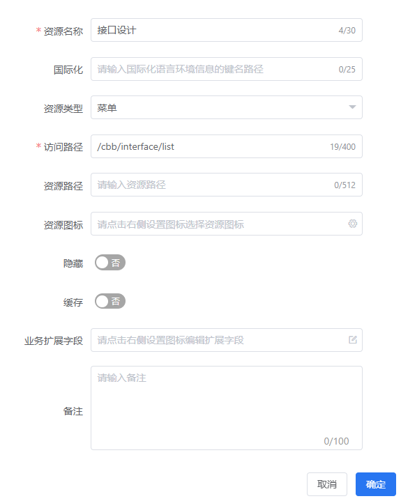
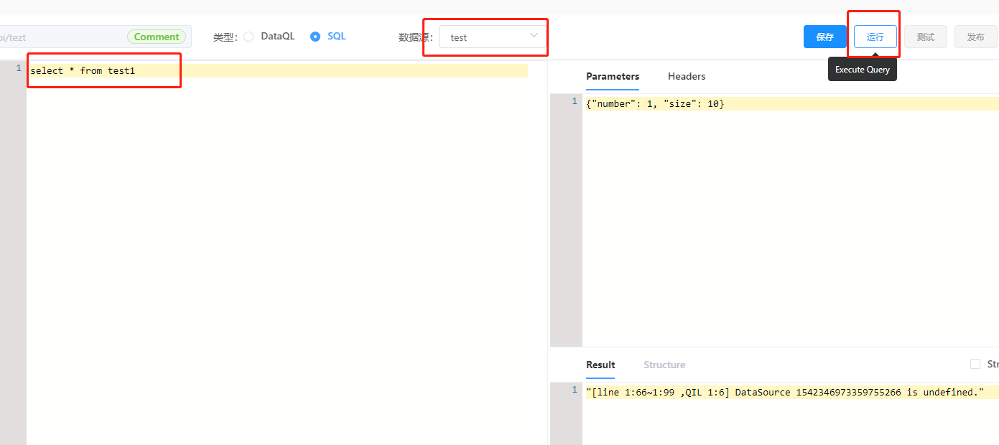
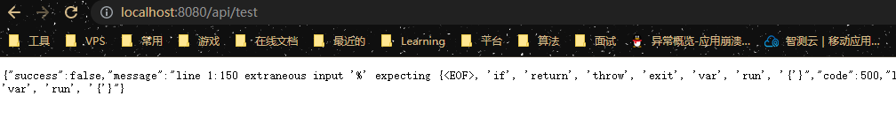

# `@tiamaes/cbb-interface` 使用手册


## 指南

### 介绍

基于 DataQL/SQL 服务聚合能力，为应用提供的一个接口配置工具。使得使用者无需开发任何代码就配置一个满足需求的接口。

整个接口配置、测试、冒烟、发布, 都通过组件提供的 UI 界面完成。进而改进项目的迭代效率，大大减少项目研发成本。

#### 使用场景

**取数据**

- 在一些**报表、看板**纯展示类的项目中。做到了所有接口真正的零开发全配置。所有取数逻辑全部通过 DataQL + SQL 的方式满足。
  - 在此期间遇到最大的挑战是复杂查询中需要拼SQL，随着 DataQL 查询组件的完善，这一问题将被攻克。
- 对比往期项目对于后端技术人员的需求从 3～5 人的苦逼通宵加班，直接缩减为**1 人配置化搞定**
  - 即便是第二天要上线新的逻辑，通过 DataQL + SQL。依然可以分分钟满足需求变更。

**存数据**

- 在内部某个类 ERP 项目中，20多个表单页面。每个表单页面或多或少都有直接将单据数据录入到数据库的场景，每个单据的录入逻辑都有很大的不同。
  - 我们通过 DataQL + SQL 的方式在早期用了1000 行左右的核心代码。其它数据存取逻辑全部配置化完成。
- 如今随着 DataQL 工具链的完善，其中绝大部分场景可以完全配置化无需开发了。

**数据聚合**

- 和 GraphQL 相同，这是设计 DataQL 的初衷。将数据库和服务等多个结果进行汇聚然后返回给前端。 

### 快速上手

#### 下载

在项目根目录打开命令行, 执行:

```shell
npm i @tiamaes/cbb-interface
```

#### 安装

在项目源代码目录中的入口文件 `src/main.js` 中引入:

```js
import CbbInterface from "@tiamaes/cbb-interface";
Vue.use(CbbInterface);
```

#### 使用

以设计页面为例

1. 在项目根目录 `src/views/` 下创建页面文件, 路径 `src/views/cbb/interface/list.vue`, 实际使用时可按需要修改


2. 页面中局部注册管理页组件

```vue
<template>
  <list-page></list-page>
</template>
<script>
import { ListPage } from "@tiamaes/cbb-interface";
export default {
  components: { ListPage }
};
</script>

```

3. 创建菜单, 访问路径与源代码目录中页面文件路径一致

   

4. 刷新, 点击对应菜单即可看到管理页面.  

***
## 组件

### ListPage

接口管理页面.

#### 界面介绍


1. 新增
2. 操作按钮
3. 接口参数及请求头设置
4. 响应结果预览

#### 使用

1. **新建一个接口**

   点击新增按钮, 打开接口编辑界面.

   

   提供了两种语言模式, 我们可以使用强大的 DataQL 查询语言，也可以直接使用 SQL 语言.

2. **执行查询**

   首先我们在 SQL 模式下尝试执行一条 select 查询.

   

   选择数据源, 填写 SQL 语句后, 点击执行按钮, 立即可以看到这条 SQL 的查询结果.

   同样的方式我们使用 DataQL 需要这样写:

   ```sql
   var query = @@sql()<%
       select * from interface_info
   %>
   return query()
   ```

   其中 var query = **@@sql()<% ... %>** 是用来定义 SQL 外部代码块，并将这个定义存入 query 变量名中。 <% %> 中间的就是 SQL 语句。

   最后在 DataQL 中调用这个代码块，并返回查询结果。

3. ****

   **保存发布**

   当接口写好之后就可以保存发布了，为了测试方便，我选用 GET 方式。

   

   操作顺序: 保存 -> 测试 -> 发布

   发布以后, 可以在接口管理页面测试:

   

   操作步骤: 选择接口 -> 点击执行按钮 -> 预览区域返回结果.

   也可以直接在浏览器地址栏请求接口地址:

   

   

## 附录
- [后端动态接口模块 m1-dynamic-api 文档](https://tiamaes.yuque.com/docs/share/ab79bc1b-5cc9-465d-aa55-ed14b3867325?#)

***
## [更新日志](http://192.168.250.101/ve-group/cbb/blob/dev/packages/interface/CHANGELOG.md)
