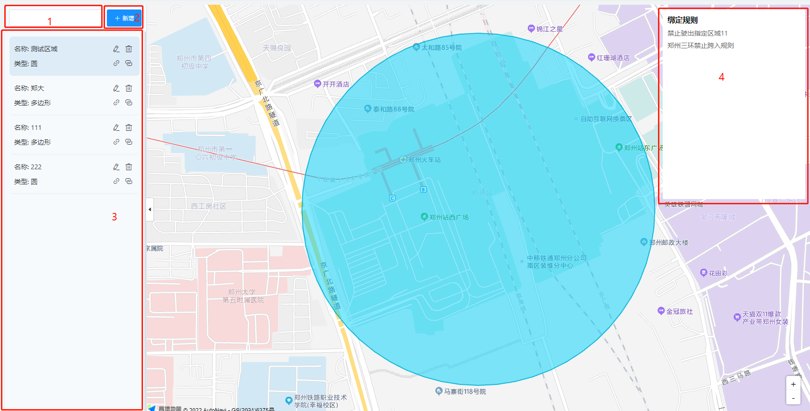
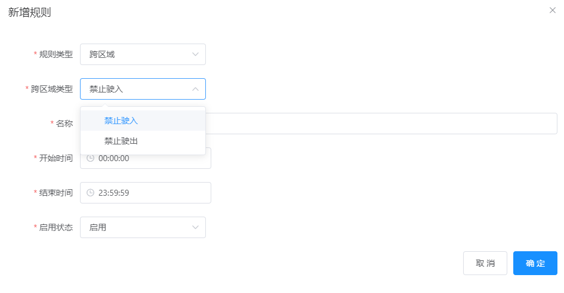

# `@tiamaes/cbb-map-service` 使用手册

## 指南
### 介绍

一些基于地图定位的通用业务集合, 包括:

- 电子围栏
- 围栏规则
- 实时监控
- 轨迹回放

### 快速上手

#### 下载

在项目根目录打开命令行, 执行:

```shell
npm i @tiamaes/cbb-map-service
```

#### 安装

在项目源代码目录中的入口文件 *`src/main.js`* 中引入:

```js
import cbbMapService from '@tiamaes/cbb-map-service';
Vue.use(cbbMapService, {
  request, // 请求实例
  moduleURL: '', // 无则忽略
})
```

#### Vue.config 配置

由于是源代码发布且使用了 `es6` 语法, 运行项目时可能出现错误.

需要在 `vue.config.js` 中配置:

```js
transpileDependencies: [
    "@tiamaes/cbb-map-service", // 新增
    "@tiamaes/map", // 依赖项
],
```

保存重启项目即可.

#### 使用

以电子围栏为例

1. 在项目根目录 *`src/views/`* 下创建页面文件, 路径 *`src/views/demo/mapVideo/views/fence.vue`*. `*使用时可以根据实际情况修改路径`

   

2. 页面中局部注册电子围栏页面

   ```vue
   <template>
     <fence-view></fence-view>
   </template>
   
   <script>
   import { FenceView } from '@tiamaes/cbb-map-service';
   export default {
       components: {
           FenceView
       },
   }
   </script>
   
   <style>
   
   </style>
   ```

   

3. 创建菜单, 访问路径与源代码目录中页面文件路径一致

   

4. 刷新, 点击对应菜单即可看到管理页面. 

***
## 组件

### FenceView

电子围栏地图展示


### FenceRule

电子围栏规则列表


#### 代码演示

```vue
<template>
  <fence-rule></fence-rule>
</template>

<script>
import { FenceRule } from '@tiamaes/cbb-map-service';
export default {
    components: {
        FenceRule
    },
}
</script>

<style>

</style>
```


### Monitor

实时监控


#### 代码演示

```vue
<template>
  <monitor></monitor>
</template>

<script>
import { Monitor } from '@tiamaes/cbb-map-service';
export default {
    components: {
        Monitor
    },
}
</script>

<style>

</style>
```

### Playback

轨迹回放


#### 代码演示

```vue
<template>
  <playback></playback>
</template>

<script>
import { Playback } from '@tiamaes/cbb-map-service';
export default {
    components: {
        Playback
    },
}
</script>

<style>

</style>
```

#### 属性

| 名称         | 类型                                 | 说明                                              |
| ------------ | ------------------------------------ | ------------------------------------------------- |
| speedOptions | Array<{name: string, value: number}> | 倍速播放选择框选项数组, 默认基准值 50 (千米/小时) |
|              |                                      |                                                   |
|              |                                      |                                                   |

***
## 使用

### 电子围栏

#### 页面介绍



1. 名称过滤输入框
2. 新增按钮
3. 操作区域
4. 电子围栏规则展示

#### 新增/编辑

**新增**

点击新增按钮打开弹窗, 输入名称、类型后, 点击开始按钮, 使用鼠标工具绘制覆盖物


**编辑**

点击操作区域的列表项, 地图会自动移动到该区域, 点击编辑图标, 打开编辑窗口, 可以对电子围栏名称、区域等进行修改.


#### 删除

点击列表项上的删除图标, 可以删除选中的电子围栏


#### 绑定规则

点击列表项上的绑定规则图标, 可以打开围栏规则弹窗, 选择已有的规则, 可多选


#### 绑定权限

点击列表项的绑定权限图标, 可以打开权限设置窗口, 分配权限


### 围栏规则

#### 页面介绍


1. 名称查询
2. 新增
3. 操作列: 编辑、删除

#### 新增

点击新增按钮, 打开表单弹窗. 规则类型包含跨区域、聚集、限速等, 默认跨区域



**聚集**


**限速**


#### 编辑

点击操作列的编辑按钮, 可以打开编辑表单, 规则类型不能修改.


#### 删除

点击操作列的删除按钮, 可以删除选中的规则.

### 实时监控

#### 页面介绍


1. 树节点过滤输入框
2. 车辆树, 支持右键菜单
3. 显示全部车辆
4. 地图图层切换

#### 右键菜单

鼠标悬浮在要操作的车辆节点, 右键单击, 打开操作菜单


#### 显示全部

勾选显示全部选择框, 可以快速选中所有树节点, 并以点聚合形式在地图展示车辆图标


### 轨迹回放
#### 页面介绍


1. 车辆节点过滤输入框
2. 车辆树
3. 轨迹查询时间范围选择
4. 查询按钮
5. 播放速度选择
6. 播放按钮
7. 轨迹点列表

#### 轨迹播放

选中车辆、时间范围查询出历史轨迹后, 可以点击播放按钮查看历史轨迹. 点击播放速度选择框可切换播放速度, 播放速度可以通过设置组件属性实现定制.


***
## [更新日志](http://192.168.250.101/ve-group/cbb/blob/dev/packages/online-designer/CHANGELOG.md)