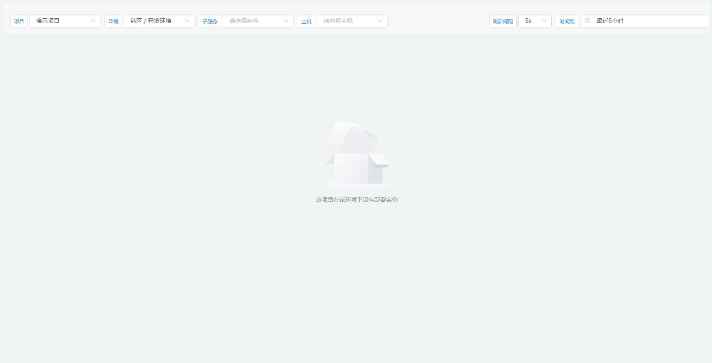

# `@tiamaes/cbb-monitor` 使用手册

## 指南
### 介绍

M1 系统监控组件的前端配套设施, 负责监控信息的多维度展示. 包括:

- 系统监控
- 告警规则
- 告警策略
- 监控日志
- 告警信息
- 告警分析

### 快速上手

#### 下载

在项目根目录打开命令行, 执行:

```shell
npm i @tiamaes/cbb-monitor
```

#### 安装

在项目源代码目录中的入口文件 `src/main.js` 中引入:

```js
import cbbMonitor from '@tiamaes/cbb-monitor';
Vue.use(cbbMonitor);
```

#### Vue.config 配置

由于是源代码发布, 运行项目时可能出现错误

需要在 `vue.config.js` 中配置:

```js
transpileDependencies: [
    "@tiamaes/cbb-monitor", // 新增
],
```

保存重启项目即可.

#### 使用

以告警信息为例:

1. 在项目根目录 *`src/views/`* 下创建页面文件, 路径 *`src/views/monitor/information.vue`*, 实际使用时可按需修改.

2. 导入并注册页面组件

   ```vue
   <template>
     <alarm-information />
   </template>
   
   <script>
   import { AlarmInformation } from "@tiamaes/cbb-monitor";
   export default {
     components: {
       AlarmInformation
     }
   }
   </script>
   ```

   

3. 在资源管理增加菜单

   

4. 刷新, 即可看到创建的菜单.

***
## 组件
### AlarmInformation

告警信息


### AlarmLog

告警日志


#### 代码演示

```vue
<template>
  <alarm-log />
</template>

<script>
import { AlarmLog } from "@tiamaes/cbb-monitor";
export default {
  components: {
    AlarmLog
  }
}
</script>

```


### AlarmRule

告警规则


#### 代码演示

```vue
<template>
  <alarm-rule />
</template>

<script>
import { AlarmRule } from "@tiamaes/cbb-monitor";
export default {
  components: {
    AlarmRule
  }
}
</script>

```

### AlarmStatus

服务器节点监控


#### 代码演示

```vue
<template>
  <alarm-status />
</template>

<script>
import { AlarmStatus } from "@tiamaes/cbb-monitor";
export default {
  components: {
    AlarmStatus
  }
}
</script>

```


### AlarmStrategy

告警策略


#### 代码演示

```vue
<template>
  <alarm-strategy />
</template>

<script>
import { AlarmStrategy } from "@tiamaes/cbb-monitor";
export default {
  components: {
    AlarmStrategy
  }
}
</script>

```


### AlarmTimeAnalysis

告警时间分析


#### 代码演示

```vue
<template>
  <alarm-time-analysis />
</template>

<script>
import { AlarmTimeAnalysis } from "@tiamaes/cbb-monitor";

export default {
  components: {
    AlarmTimeAnalysis,
  }
}
</script>
```


### AlarmDistributedAnalysis

告警分布分析


#### 代码演示

```vue
<template>
  <alarm-distributed-analysis />
</template>

<script>
import { AlarmDistributedAnalysis } from "@tiamaes/cbb-monitor";
export default {
  components: {
    AlarmDistributedAnalysis,
  }
}
</script>
```


### AlarmDurationAnalysis

持续时间分析


#### 代码演示

```vue
<template>
  <alarm-duration-analysis />
</template>

<script>
import { AlarmDurationAnalysis } from "@tiamaes/cbb-monitor";
export default {
  components: {
    AlarmDurationAnalysis,
  }
}
</script>
```

### Monitor

系统监控, 根据监控类型属性展示不同的监控信息.

以连接池监控为例:



#### 代码演示

```vue
<template>
  <monitor data-type="connection" jobType="java"/>
</template>

<script>
import { Monitor } from "@tiamaes/cbb-monitor";
export default {
  components: { Monitor }
};
</script>

```

#### 属性

| 名称        | 类型    | 说明                                                         |
| ----------- | ------- | ------------------------------------------------------------ |
| dataType    | string  | 监控类型, 详细释义见下表                                     |
| jobType     | string  | 项目环境列表查询参数, 一般为 `java`                          |
| shouldcache | boolean | 是否要缓存内容, 默认 `false`. **不建议使用, 推荐在资源管理中维护** |

#### 监控类型

| 类型       | 分类       | 说明       |
| ---------- | ---------- | ---------- |
| connection | 应用监控   | 连接池监控 |
| KAFKA      | 中间件监控 | KAFKA监控  |
| LOKI       | 中间件监控 | LOKI日志   |
| NACOS      | 中间件监控 | NACOS监控  |
| REDIS      | 中间件监控 | REDIS监控  |
| MYSQL      | 数据库监控 | MYSQL监控  |
| NODE       | 服务器监控 | 服务器监控 |
| ORACLE     | 数据库监控 | ORACLE监控 |
| throughput | 应用监控   | 吞吐量监控 |
| java       | 应用监控   | 虚拟机监控 |


***
## [更新日志](http://192.168.250.101/ve-group/cbb/blob/dev/packages/monitor/CHANGELOG.md)
