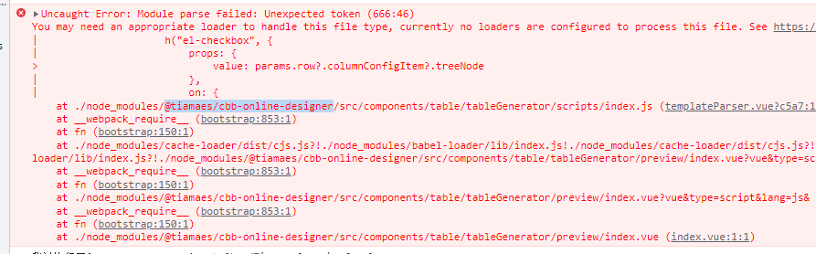
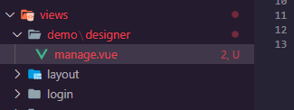
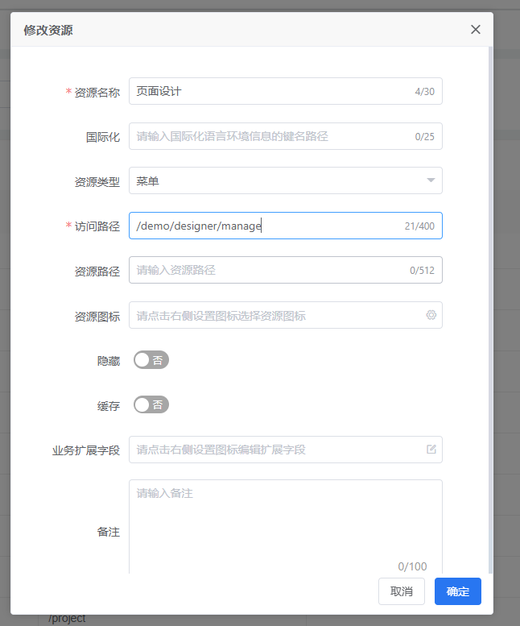
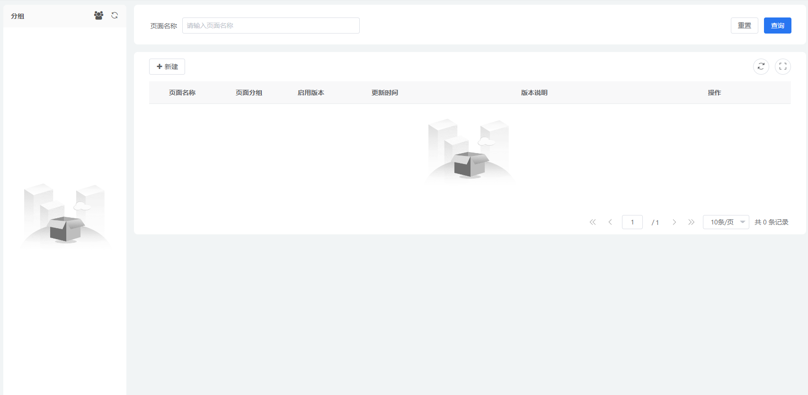
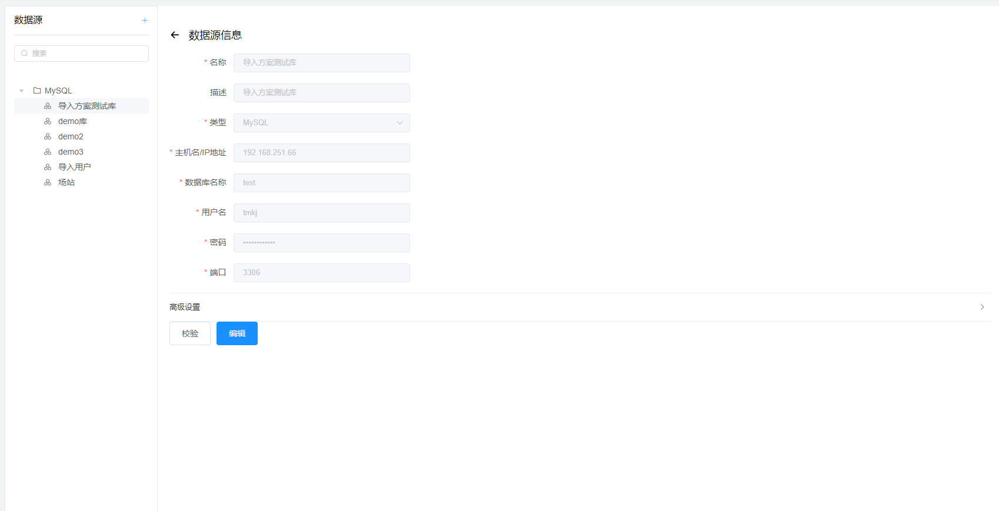
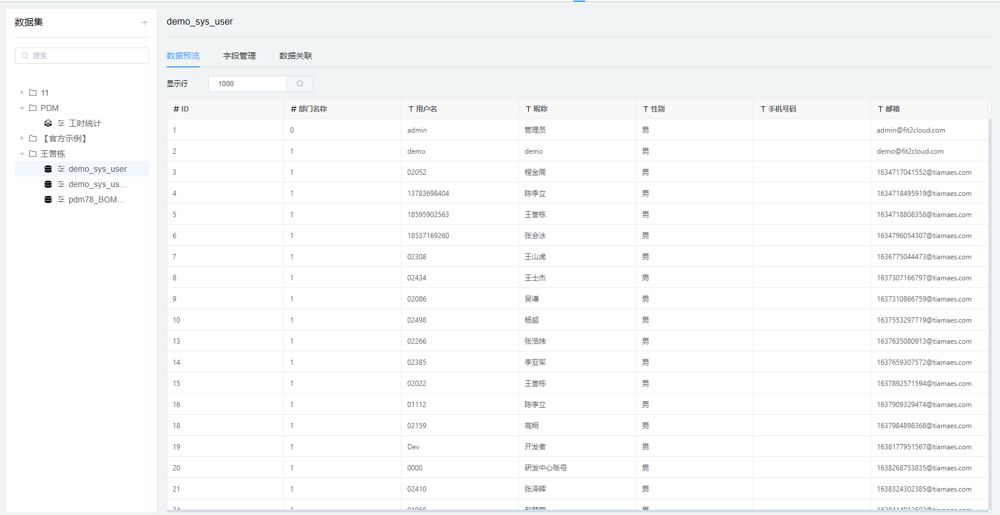

# `@tiamaes/cbb-online-designer` 使用手册

> **不再维护, 核心功能迁移至 `@tiamaes/cbb-table-generator`**

## 指南

### 介绍

该业务组件旨在通过可视化拖拽操作, 设计出所见即所得的 Web 页面, 使非开发人员也能根据一定的需求实现数据展示类的功能.

能够减轻开发成本, 减少沟通, 提升工作效率.

同类产品有帆软BI、积木、DataEase 等

### 快速上手

#### 下载

在项目根目录打开命令行, 执行:

```shell
npm i @tiamaes/cbb-online-designer
```

#### 安装

在项目源代码目录中的入口文件 `src/main.js` 中引入:

```js
import cbbOnlineDesigner from "@tiamaes/cbb-online-designer";
Vue.use(cbbOnlineDesigner);
```

 #### Vue.config 配置

由于是源代码发布, 运行项目时可能出现错误:



需要在 `vue.config.js` 中配置:

```js
transpileDependencies: [
    "@tiamaes/cbb-online-designer", // 新增
],
```

保存重启项目即可.

#### 使用

以管理页为例

1. 在项目根目录 `src/views/` 下创建页面文件, 路径 `src/views/demo/designer/manage.vue`



2. 页面中局部注册管理页组件

```vue

```

3. 创建菜单, 访问路径与源代码目录中页面文件路径一致

   

4. 刷新, 点击对应菜单即可看到管理页面.  

***
## 组件

### ManagePage

管理列表页面. 维护所有在线设计出的页面



### PreviewPage

设计预览页面. 通过路径上的页面ID参数, 动态解析出设计好的页面.

#### 使用

```vue
<template>
  <preview-page></preview-page>
</template>

<script>
import { PreviewPage } from '@tiamaes/cbb-online-designer'
export default {
    components: {
        PreviewPage,
    }
}
</script>                       

<style>

</style>
```


### DataSourcePage

数据源管理


#### 使用

```vue
<template>
  <data-source-page></data-source-page>
</template>

<script>
import { DataSourcePage } from '@tiamaes/cbb-online-designer'
export default {
    components: {
        DataSourcePage,
    }
}
</script>                       

<style>

</style>
```
### DataSetPage

数据集管理


#### 使用

```vue
<template>
  <data-set-page></data-set-page>
</template>

<script>
import { DataSetPage } from '@tiamaes/cbb-online-designer'
export default {
    components: {
        DataSetPage,
    }
}
</script>                       

<style>

</style>
```
### Designer

设计器组件, 可以添加图表、表格、文本、图片、内嵌页面等

> 大多数情况下不需要在项目内使用

#### 使用

```vue
<template>
  <designer></designer>
</template>

<script>
import { Designer } from '@tiamaes/cbb-online-designer'
export default {
    components: {
        Designer,
    }
}
</script>                       

<style>

</style>
```
#### 属性

| 名称      | 类型    | 说明     |
| --------- | ------- | -------- |
| id        | string  | 页面 ID  |
| versionId | string  | 版本 ID  |
| show      | boolean | 是否展示 |


### Parser

页面解析组件, 根据页面ID及版本, 渲染指定的页面.

> 大多数情况下不需要在项目内使用

#### 使用

```vue
<template>
  <parser></parser>
</template>

<script>
import { Parser } from '@tiamaes/cbb-online-designer'
export default {
    components: {
        Parser,
    }
}
</script>                       

<style>

</style>
```
#### 属性

| 名称      | 类型   | 说明    |
| --------- | ------ | ------- |
| id        | string | 页面 ID |
| versionId | string | 版本 ID |
|           |        |         |


***
## [更新日志](http://192.168.250.101/ve-group/cbb/blob/dev/packages/online-designer/CHANGELOG.md)