# `@tiamaes/cbb-screen-builder` 使用手册
> **不再维护**

## 指南
### 介绍

可视化数据大屏 是一站式数据可视化展示平台，旨在帮助用户快速通过可视化图表展示海量数据，10 分钟零门槛打造出专业大屏数据展示。精心预设多种行业模板，极致展示数据魅力。采用拖拽式自由布局，无需编码，全图形化编辑，快速可视化制作。大屏设计器支持多种数据来源配置，支持数据实时同步更新，同时大屏设计器基于 WEB 页面渲染，可灵活投屏多种屏幕终端。

### 快速上手

#### 下载

在项目根目录打开命令行, 执行:

```shell
npm i @tiamaes/cbb-screen-builder
```

#### 安装

在项目源代码目录中的入口文件 `src/main.js` 中引入:

```js
import cbbScreenBuilder from '@tiamaes/cbb-screen-builder';
Vue.use(cbbScreenBuilder, {
  request, // 请求实例
  moduleUrl: '', // 模块路径, 不需要可以省略
  router, // 路由实例
  i18n, // vue-i18n 实例
})
```

> **由于存在一些业务初始化逻辑, 组件的插件选项不可省略**

 #### Vue.config 配置

由于是源代码发布, 需要在 `vue.config.js` 中配置:

```js
transpileDependencies: [
    "@tiamaes/cbb-screen-builder", // 新增
],
```

保存重启项目即可.

#### 导入资源

在项目源代码目录视图文件夹下创建两个文件:

> 由于代码设计问题, 路径名称固定为:
>
> - `/src/views/screen/build.vue`
> - `/src/views/screen/view.vue`

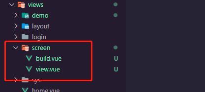

引入设计组件

```vue
<template>
  <builder></builder>
</template>

<script>
import { Builder } from '@tiamaes/cbb-screen-builder';
export default {
    components: {
        Builder
    },
}
</script>

<style>

</style>
```

引入解析组件

```vue
<template>
  <viewer></viewer>
</template>

<script>
import { Viewer } from '@tiamaes/cbb-screen-builder';
export default {
    components: {
        Viewer
    },
}
</script>

<style>

</style>
```

#### 使用

大屏设计器有两个功能入口页面, 是两个资源菜单. 路径不固定.

以大屏管理列表页面为例:

```vue
<template>
  <screen-list></screen-list>
</template>

<script>
import { ScreenList } from '@tiamaes/cbb-screen-builder';
export default {
    components: {
        ScreenList,
    },
}
</script>

<style>

</style>
```

在资源管理页面新增一个菜单:

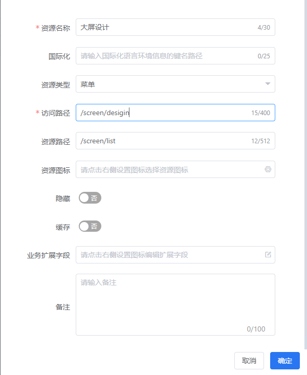

***
***
## 组件

### Builder

大屏设计组件, 项目创建本地资源文件以后自动注册菜单.

### Viewer

预览组件, 从路径中获取页面ID, 展示设计好的大屏. 项目创建本地资源文件以后自动注册菜单.

### ScreenList

管理列表页面

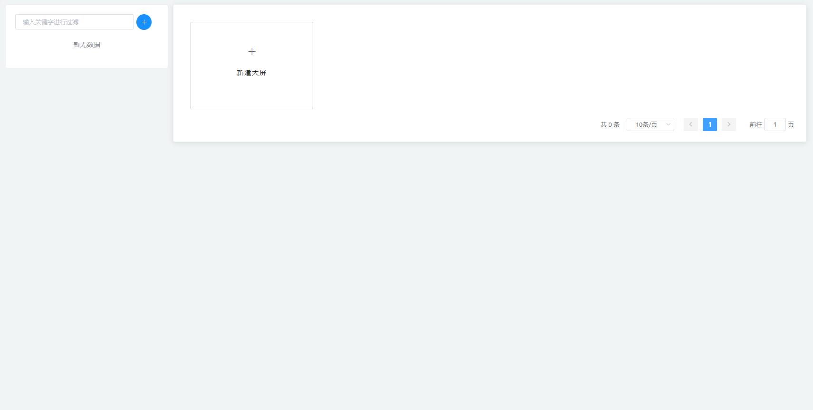

### MapList

地图列表页面

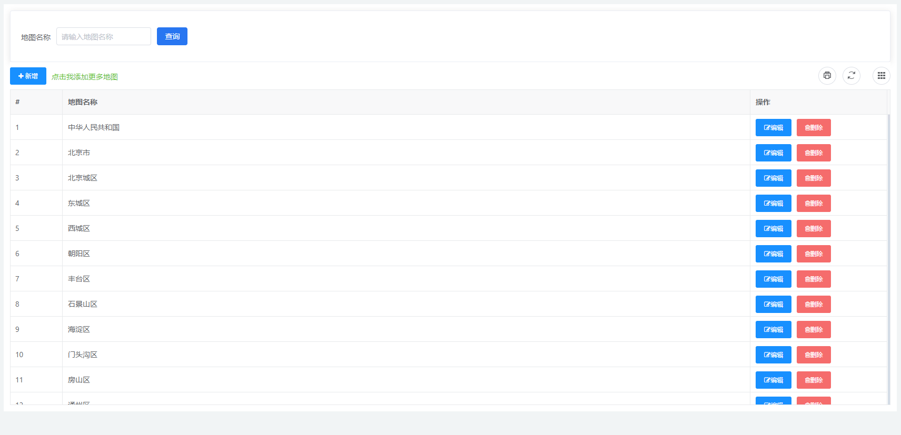

***
## 使用

### 大屏设计器

#### 新建大屏

1. 创建空白大屏

   在大屏管理列表页面, 点击'新建大屏', 填写大屏名称

   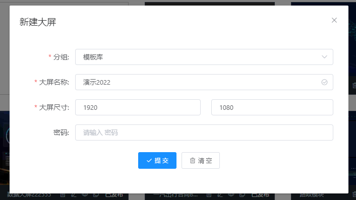

   保存成功后, 自动打开设计页面

   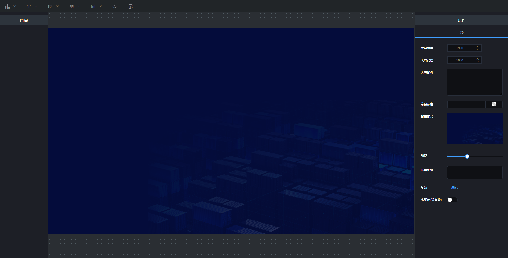

2. 使用模板

   如果觉的模版中有符合自己设计的内容，点击“复制”按钮，就可以复制一个跟模版一模一样的

   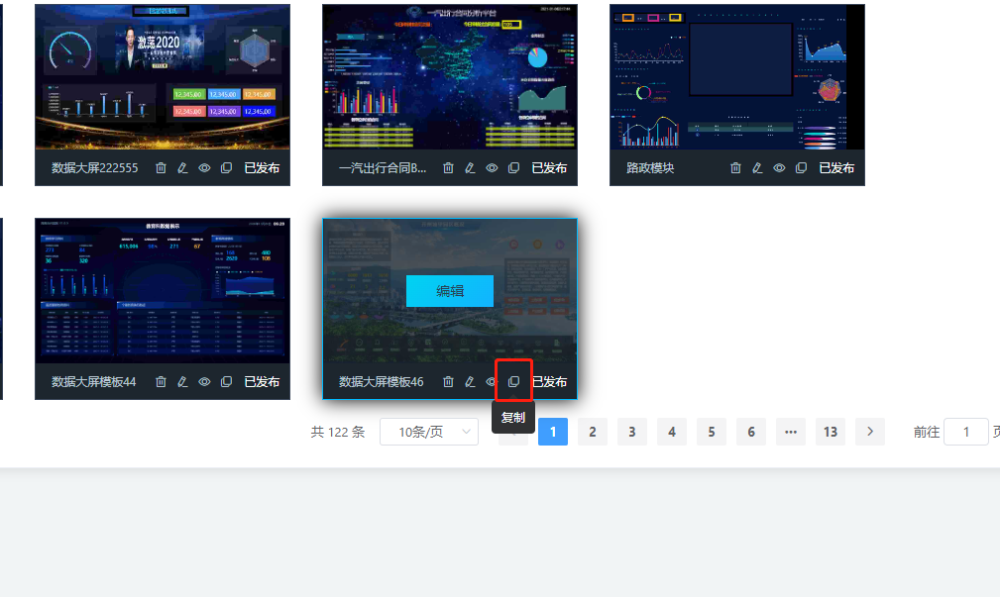

#### 修改大屏

**1. 修改大屏名称等信息**

如果想对编辑好的大屏名称、密码等信息修改，可点击“编辑”按钮，进行修改；

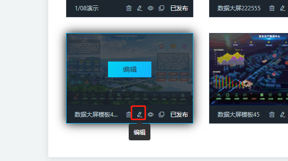

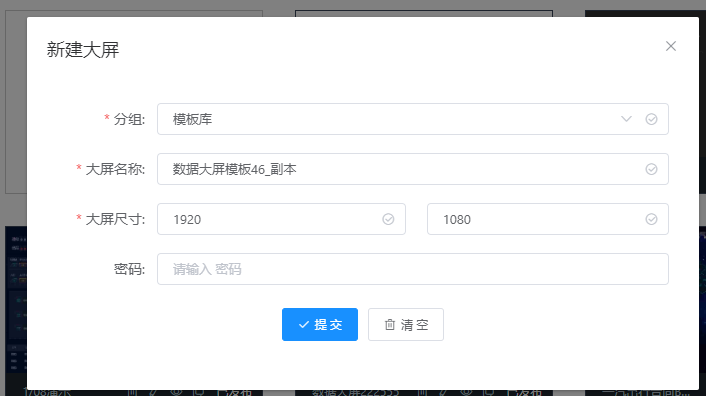

**2. 修改大屏内容**

点击任意大屏的编辑按钮，即可进入大屏编辑界面

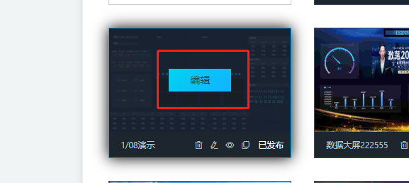

#### 预览保存

**1、保存**

设计好后，点击任务栏中的“”按钮，可对报表进行保存；


**2、预览**

设计好后，点击任务栏中的“”按钮，可对报表进行预览；


#### 画布介绍

 **1、组件栏**

画布顶部为组件栏，可以点击使用任何组件


 **2、设计区域**

标注的地方为设计区域，可以在画布内使用任何组件进行设计；


**3、属性配置区域**

画布右侧为属性配置区域，可以通过调整属性区域的参数来设置画布的大小、颜色等；


**4、图层的区域**

画布左侧为图层区域，可以通过名称快速定位到画布中的组件；


#### 添加组件

在导航栏中，点击要的组件，即可完成组件的添加


#### 组件图层位置
**1、拖动调整**

可以通过鼠标拖动，改变图层位置；也可以通过托、拽组件，使组件变大或缩小；

**2、样式板块调整**

点击图层右侧画布样式板块中的“参数”处，就可调整图层的大小和位置，如下图

- 宽度：图层的宽度；
- 高度：图层的高度；
- X位置：图层距离X轴的位置；
- Y位置：图层距离Y轴的位置；


#### 其他操作

**1. 删除**

如果你想对大屏模板进行删除，可点击“删除”按钮，对大屏进行删除
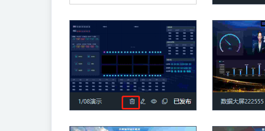

**2. 设置密码**

在新建大屏的时候，最好设置大屏密码，这样创建的大屏，别人就不会随意修改和删除。

**3.背景和封面设置**

（1）设置大屏背景
点击编辑页面背景处，右侧样式设置区域，可以设置背景宽度、高度、背景颜色等，如下图


#### 大屏集成

**1、复制浏览器中的预览地址的链接**

**2、在系统管理资源管理页面增加菜单**

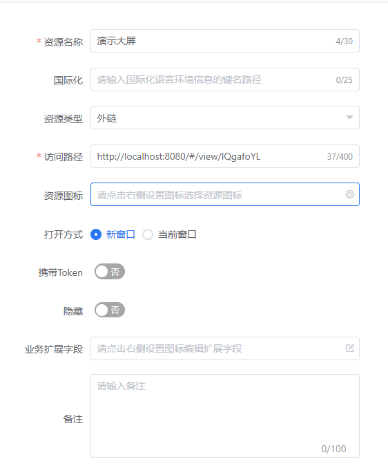

**3、角色授权**

如需控制访问权限, 可在角色管理分配此菜单的权限

#### 组合分组

**如果想让几个组件分组在一起，怎么实现呢？**

**操作步骤如下：**

 **1、选中任意一个组件，右键选择“组合分组”；**


**2、将需要组合的组件，拖动到新建的那个文件夹中；**


**3、复制组合图层**

在图层文件夹上，右键点击，选择“复制图层”，就可以复制一个图层；


#### 大屏属性配置

**1、大屏简介**

- 大屏简介：大屏的简单介绍；
  

**2、大屏大小**

- 大屏宽度：大屏大宽度，可根据投放显示器的屏幕大小来设置；
- 大屏高度：大屏的高度是多少，可根据投放显示器的屏幕大小来设置；
  

**3、大屏背景**

- 背景颜色：大屏的背景颜色（只有没有背景图的时候，才显示出来）；
- 缩略图：大屏列表显示的图片；
- 背景图：大屏的背景图片；
  

**4、大屏比例**

- 缩放：大屏的缩放比例，默认66；
  

**5、环境地址**

比如设计大屏的时候，环境地址配置成“http://api.jeecg.com/mock/26”，组件添加API参数的时候，“http://api.jeecg.com/mock/26/bar” 可以写成 “${HOME_URL}/bar”


**6、水印**

如果想大屏上带上水印样式，可在这里设置。

- 水印开关：水印是否显示；
- 内容：水印内容；
- 大小：水印文字大小；
- 颜色：水印文字颜色；
- 角度：水印文字角度；
  

### 地图管理

用于管理维护地图数据

#### 新增/编辑

点击按钮, 编辑名称和 `geojson` 格式的地图数据

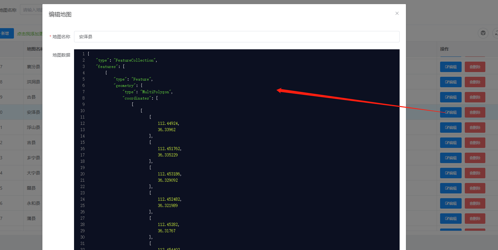


***
## [更新日志](http://192.168.250.101/ve-group/cbb/blob/dev/packages/screen-builder/CHANGELOG.md)