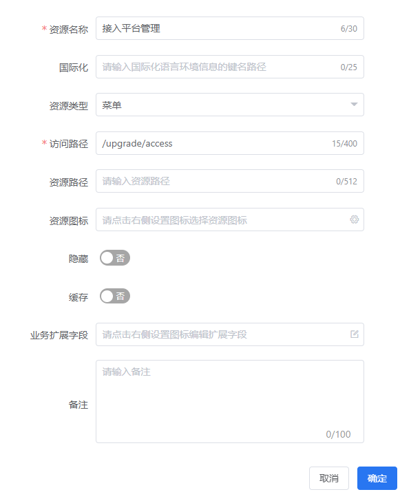
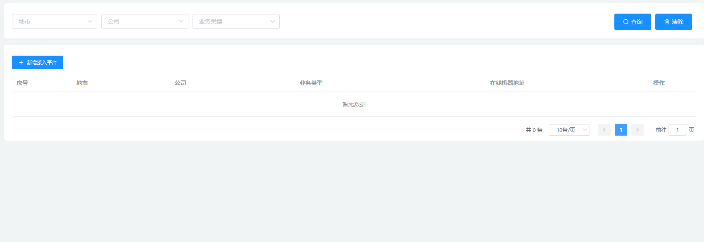
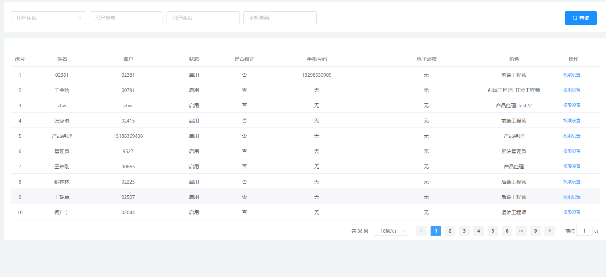
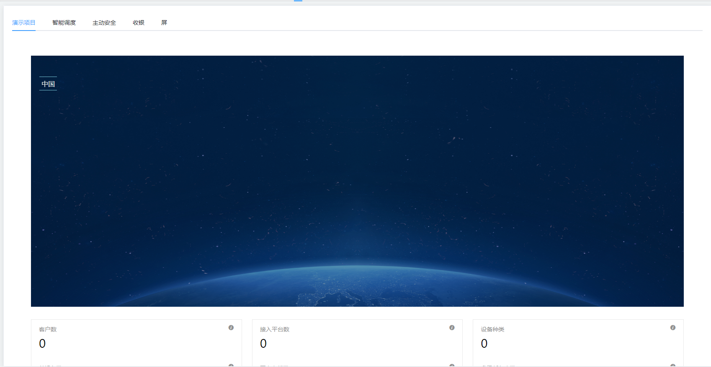
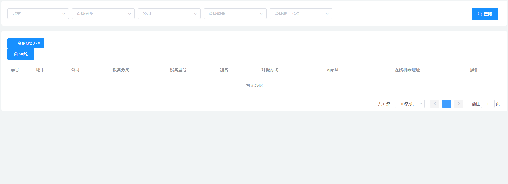
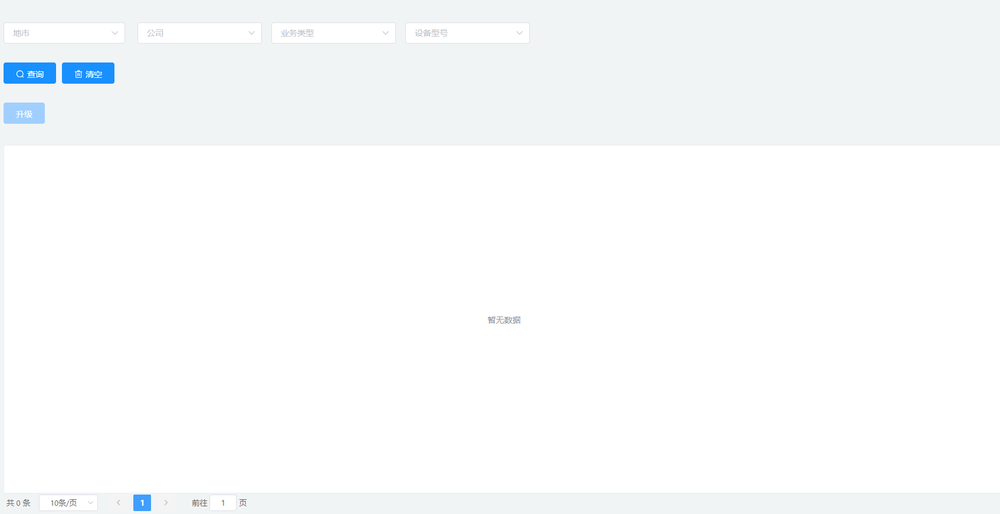
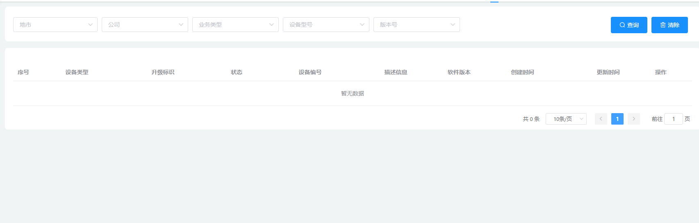
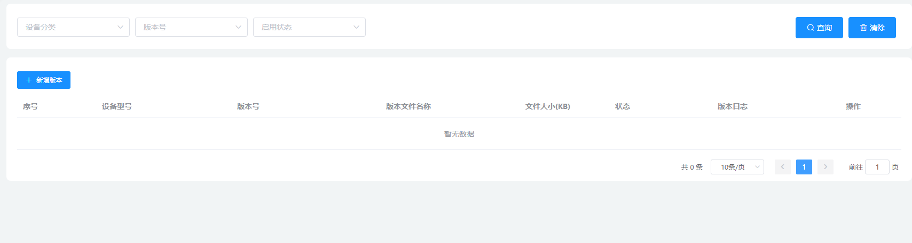

# `@tiamaes/cbb-upgrade` 使用手册


> **不再维护**

## 指南

### 介绍

**外置依赖**

- @tiamaes/ve-framework
- @tiamaes/vxe-table
- @tiamaes/auto-table
- @tiamaes/tree
- echarts
- lodash


### 快速上手

#### 下载

在项目根目录打开命令行, 执行:

```shell
npm i @tiamaes/cbb-upgrade
```

#### 安装

在项目源代码目录中的入口文件 `src/main.js` 中引入:

```js
import cbbUpgrade from "@tiamaes/cbb-upgrade";
Vue.use(cbbUpgrade);
```


#### 使用

以接入平台管理页为例

1. 在项目根目录 `src/views/` 下创建页面文件, 路径 `src/views/upgrade/access.vue`

2. 页面中局部注册管理页组件

```vue
<template>
  <page />
</template>

<script>
import { access } from "@tiamaes/cbb-upgrade";
export default {
  components: {
    page: access
  }
};
</script>

```

3. 创建菜单, 访问路径与源代码目录中页面文件路径一致

   

4. 刷新, 点击对应菜单即可看到管理页面.  

***
## 组件

### access

接入平台管理



#### 属性
| 名称             | 类型   | 说明                        |
| ---------------- | ------ | --------------------------- |
| `dialogMaps`     | object | `auto-table` 自定义弹窗配置 |
| `buttonsPrepend` | array  | 操作列里最前面追加按钮      |
| `operationWidth` | number | 操作列宽度                  |

### condition

地市数据权限设置




#### 使用

```vue
<template>
  <page />
</template>

<script>
import { condition } from "@tiamaes/cbb-upgrade";
export default {
  components: {
    page: condition
  }
};
</script>

```
#### 属性
| 名称             | 类型   | 说明                        |
| ---------------- | ------ | --------------------------- |
| `dialogMaps`     | object | `auto-table` 自定义弹窗配置 |
| `buttonsPrepend` | array  | 操作列里最前面追加按钮      |
| `operationWidth` | number | 操作列宽度                  |

### dashboard

数据分析、统计




#### 使用

```vue
<template>
  <page />
</template>

<script>
import { dashboard } from "@tiamaes/cbb-upgrade";
export default {
  components: {
    page: dashboard
  }
};
</script>

```
### deviceType



#### 使用

```vue
<template>
  <page />
</template>

<script>
import { deviceType } from "@tiamaes/cbb-upgrade";
export default {
  components: {
    page: deviceType
  }
};
</script>

```
#### 属性
| 名称             | 类型   | 说明                        |
| ---------------- | ------ | --------------------------- |
| `dialogMaps`     | object | `auto-table` 自定义弹窗配置 |
| `buttonsPrepend` | array  | 操作列里最前面追加按钮      |
| `operationWidth` | number | 操作列宽度                  |

### topic

#### 使用

```vue
<template>
  <page />
</template>

<script>
import { topic } from "@tiamaes/cbb-upgrade";
export default {
  components: {
    page: topic
  }
};
</script>

```


### upgrade

升级操作



#### 使用

```vue
<template>
  <page />
</template>

<script>
import { upgrade } from "@tiamaes/cbb-upgrade";
export default {
  components: {
    page: upgrade
  }
};
</script>

```


### upgradeLog

升级记录



#### 使用

```vue
<template>
  <page />
</template>

<script>
import { upgradeLog } from "@tiamaes/cbb-upgrade";
export default {
  components: {
    page: upgradeLog
  }
};
</script>

```


#### 属性

| 名称             | 类型   | 说明                        |
| ---------------- | ------ | --------------------------- |
| `dialogMaps`     | object | `auto-table` 自定义弹窗配置 |
| `buttonsPrepend` | array  | 操作列里最前面追加按钮      |
| `operationWidth` | number | 操作列宽度                  |

### version

版本(升级程序) 管理.



#### 使用

```vue
<template>
  <page />
</template>

<script>
import { version } from "@tiamaes/cbb-upgrade";
export default {
  components: {
    page: version
  }
};
</script>

```


#### 属性

| 名称             | 类型   | 说明                        |
| ---------------- | ------ | --------------------------- |
| `dialogMaps`     | object | `auto-table` 自定义弹窗配置 |
| `buttonsPrepend` | array  | 操作列里最前面追加按钮      |
| `operationWidth` | number | 操作列宽度                  |


***
## [更新日志](http://192.168.250.101/ve-group/cbb/blob/dev/packages/upgrade/CHANGELOG.md)