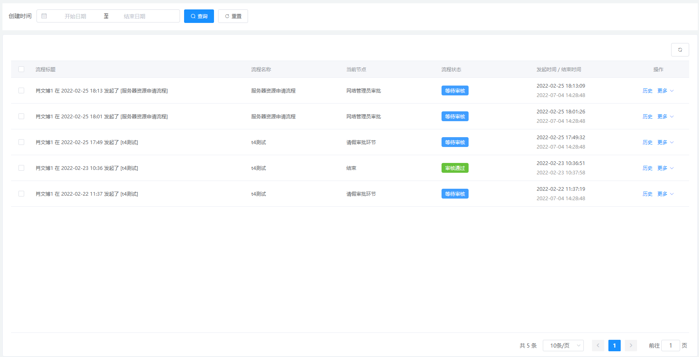

# `@tiamaes/cbb-workflow` 使用手册

> 基于 `@tiamaes/cbb-workflow@0.1.0`

## 指南

### 介绍

该组件是基于 `jeeplus-flowable` 定制开发的流程引擎. 核心构成主要有：流程设计器、流程引擎集成、动态表单设计器、表单数据引擎, 及流程、表单、任务相关管理功能等。


### 快速上手

#### 下载

在项目根目录打开命令行, 执行:

```shell
npm i @tiamaes/cbb-workflow
```

#### 安装

在项目源代码目录中的入口文件 `src/main.js` 中引入:

```js
import workflow from "@tiamaes/cbb-workflow";
Vue.use(workflow, {
  request, // 必需
  i18n, // 必需
  router, // 必需
});
```

**解释: **

> - request: 因为工作流内部包含业务逻辑, 需要请求后台接口, 所以选项中必需设置
> - i18n: 组件内部支持国际化, 所以必需设置;
> - router: 用于注册一些内部的页面

**插件选项列表**

| 名称       | 类型   | 说明                                                         |
| ---------- | ------ | ------------------------------------------------------------ |
| i18n       | object | Vue-I18n 实例                                                |
| request    | object | axios 实例                                                   |
| router     | object | VueRouter 实例                                               |
| store      | object | Vuex 实例                                                    |
| directives | object | 内部使用的指令: `dialogDrag`, `noMoreClick` 的具体实现, 默认为空函数 |


#### 使用

以流程表单为例:

1. 在项目根目录 `src/views/` 下创建页面文件, 路径 `src/views/flowable/form/FormDefinitionList.vue`

   


2. 页面中局部注册管理页组件

    ```vue
    <template>
      <page />
    </template>
    
    <script>
    import { FormDefinitionList } from "@tiamaes/cbb-workflow";
    export default {
      components: {
        page: FormDefinitionList,
      }
    }
    </script>
    
    ```

    

3. 创建菜单, 访问路径与源代码目录中页面文件路径一致

   

4. 刷新, 点击对应菜单即可看到管理页面.  

***
## 组件

### FormDefinitionList

流程表单


### HistoryList

流程监控-已完成


#### 使用

```vue
<template>
  <page />
</template>

<script>
import {HistoryList} from "@tiamaes/cbb-workflow";
export default {
  components: {
    page: HistoryList,
  }
}
</script>

```

### RunningList

流程监控-未完成


#### 使用

```vue
<template>
  <page />
</template>

<script>
import {RunningList} from "@tiamaes/cbb-workflow";
export default {
  components: {
    page: RunningList,
  }
}
</script>

```

### ModelList 

流程管理-流程设计


#### 使用

```vue
<template>
  <page />
</template>

<script>
import {ModelList} from "@tiamaes/cbb-workflow";
export default {
  components: {
    page: ModelList,
  }
}
</script>

```


### ConditionList

流程管理-流程表达式


#### 使用

```vue
<template>
  <page />
</template>

<script>
import {ConditionList} from "@tiamaes/cbb-workflow";
export default {
  components: {
    page: ConditionList
  }
}
</script>

```


### ButtonList

流程管理-常用按钮


#### 使用

```vue
<template>
  <page />
</template>

<script>
import {ButtonList} from "@tiamaes/cbb-workflow";
export default {
  components: {
    page: ButtonList,
  }
}
</script>

```

### ActCategoryList

流程管理-分类管理


#### 使用

```vue
<template>
  <page />
</template>

<script>
import { ActCategoryList } from "@tiamaes/cbb-workflow";
export default {
  components: {
    page: ActCategoryList
  }
}
</script>

```

### ListenerList

流程管理-流程监听器


#### 使用

```vue
<template>
  <page />
</template>

<script>
import {ListenerList} from "@tiamaes/cbb-workflow";
export default {
  components: {
    page: ListenerList,
  }
}
</script>

```

### TodoList

我的事务-待办/待签任务


#### 使用

```vue
<template>
  <page />
</template>
<script>
import {TodoList} from "@tiamaes/cbb-workflow";
export default {
  components: {
    page: TodoList,
  }
}
</script>

```

### TaskHistoryList

我的事务-我的经办


#### 使用

```vue
<template>
  <page />
</template>

<script>
import { TaskHistoryList } from "@tiamaes/cbb-workflow";
export default {
  components: {
    page: TaskHistoryList,
  }
}
</script>

```

### ProcessList

我的事务-发起流程


#### 使用

```vue
<template>
  <page />
</template>

<script>
import { ProcessList } from "@tiamaes/cbb-workflow";
export default {
  components: {
    page: ProcessList,
  }
}
</script>

```

### ApplyList

我的事务-我发起的流程


#### 使用

```vue
<template>
  <page />
</template>

<script>
import {ApplyList} from "@tiamaes/cbb-workflow";
export default {
  components: {
    page: ApplyList,
  }
}
</script>

```

### FlowCopyList

我的事务-我的抄送


#### 使用

```vue
<template>
  <page />
</template>

<script>
import {FlowCopyList} from "@tiamaes/cbb-workflow";
export default {
  components: {
    page: FlowCopyList,
  }
}
</script>

```

### TaskForm

发起流程


#### 使用

```vue
<template>
  <page />
</template>

<script>
import {TaskForm} from "@tiamaes/cbb-workflow";
export default {
  components: {
    page: TaskForm,
  }
}
</script>

```

***
## [更新日志](http://192.168.250.101/ve-group/cbb/blob/dev/packages/workflow/CHANGELOG.md)