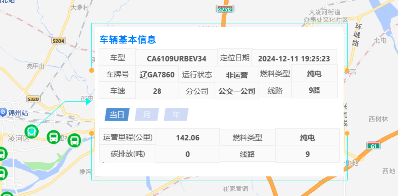

天擎自己封装的 amap 组件


###  地图实例 showDialog 方法

```
this.$mapRef.showDialog({
          coordinates,
          content: '占位', // 内容区域html，此处先占位，后续渲染真实弹窗到内部
          map: this.map, // amap创建的地图
          id: code, 	// id
          style: {
            type: 'common', 	// 弹窗类型， guideLine引导线弹窗  common 默认 普通弹窗
            ...dialogConfig,
            width,
            height,
            closeEvent: () =>
              closeFun({
                ...this.interaction,
                // 自定义属性
                config: this.config,
                context: this,
                mapRef: this.$mapRef,
                showDialog: this.$mapRef.showDialog.bind(this),
                hideDialog: this.$mapRef.hideDialog.bind(this),
              }),
          },
        });
```


原理：封装的 <amap> 组件内置了两个弹窗 

- dialog1: 自带引导线的弹窗  (type: guideLine)
- dialog2: 普通弹窗   (type: common)


dialog1 引导线的弹窗:




本质是个 `new AMap.InfoWindow`


### 地图实例 hideDialog

```
this.$mapRef.hideDialog();
```


# addMarkers 方法

```
    addMarkers({
      data,
      key = 'stationsLayer',
      onClick = null,
      onRightClick = null,
      cursor = 'pointer',
      text = false,
      textKey = 'stationName',
      textOffset = 6, // 文字偏移量 px
      autoText = false, // 是否根据线路走向自适应文字排列方向（适用于线路站点名称）
      textDirection = 'left', // 竖直线路，文字排列方向，默认线路左侧
      collision = false, // 文字是否避让
      zooms = [10, 20],
      lnglatFun = null, // 自定义获取经纬度
      image = null,
      size = [28, 32],
      zIndex = 999,
      angle = 0,
      content = null, //支持html片段，此时 image 将会失效.   html片段时用 
      contentAnchor = 'bottom-center',
    })
```

content 属性如果有值，走的是 普通的marker 点渲染。 如果没值，使用 高德的 LabelsLayer 加 LabelMarker  渲染