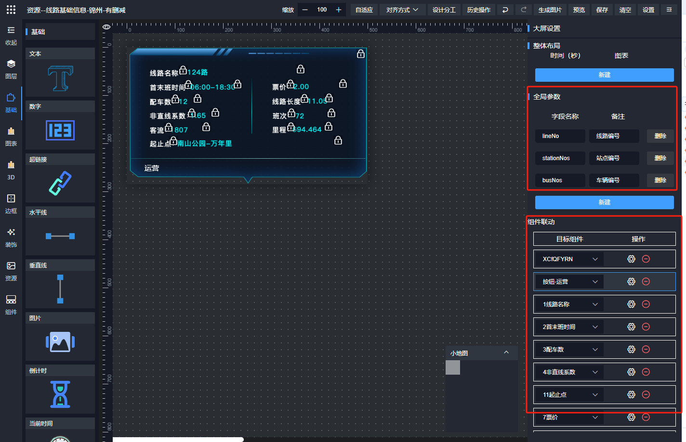
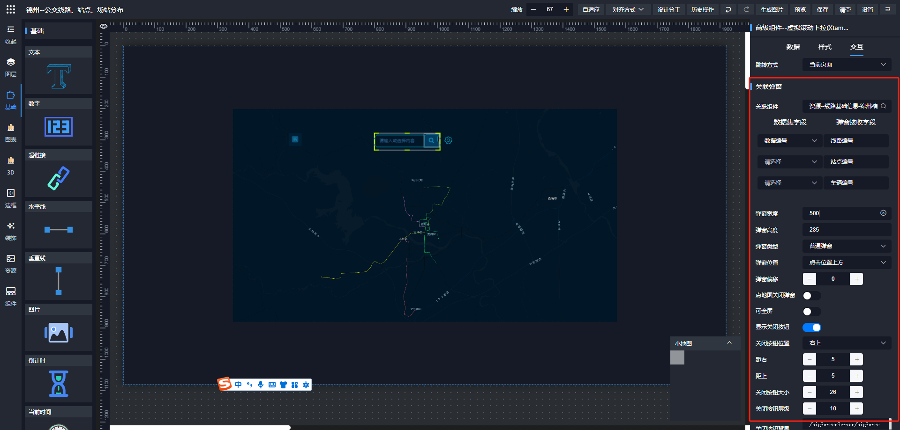

## dataroom 弹窗实现思路

1. 弹窗装的内容不需要提前拖到页面里。这就要求内容自身提前配置好数据来源
2. 弹窗只能选 ‘自定义组件’类型。 想弹其他元素需要建个自定义组件类型作为载体
3. 自定义组件设计时，需要把内部多个元素的搜索条件收集到一起形成虚拟一个搜索表单
4. 渲染弹窗内容时，接收参数赋值给表单，表单触发组件联动形成多个元素的内容过滤
5. 增加一个弹窗组件管理（或者在自定义组件里建个弹窗分组）


## 需要遵守的约定

- 弹窗需要建在‘自定义组件’分类，’弹窗’分组
- 如果需要弹出系统组件（比如地图，视频等）。也需要通过‘自定义组件作为载体’
- 弹窗的分组是前端代码定死的id，目前维护在 packages\js\config\tiamaes.js
- 弹窗实现过滤是通过全局参数联动。需要先定义全局参数，然后全局参数联动目标组件
- 页面组件关联弹窗是在交互栏进行配置，同时配置参数映射


## 弹窗参数定义

1.在弹窗的 页面级配置json 里增加 tmConfig 属性，作为天迈扩展的页面全局参数全局存放地

2.定义 tmConfig.globalParams 存放全局参数，支持从url解析同名参数（页面渲染器解析时），从props传参解析参数（弹窗渲染时）

3.定义 tmConfig.linkage 存放全局参数关联的目标视图，支持将 globalParams全局参数映射为每个视图的过滤参数

页面配置：

```
{
	code:'',
	chartList:[],
	pageConfig:{},
	...
	tmConfig:{
		globalParams:[
			{ field:'lineNo', label:'线路编号'},
			{ field:'busNo', label:'车号'},
		],
		linkage:[
			components:[
				{
					componentKey: 'shnDYhNt_dCAjA_FBXRW',	// 关联的目标组件
					maps:[
						{ 
							sourceField:'lineNo', 	// 定义在 globalParams 的全局参数字段
							targetField:'lineNos', 	// 联动目标组件的过滤参数字段
							queryRule:'=' 			// 映射关系，目前是固定的 ’=‘
						}
					]
				},
			]
		]

	}
}
```




## 唤起方配置定义

1. 视图的配置属性里增加了 tmConfig，作为天迈扩展的参数集中存放地
2. 定义 tmConfig.dialog 配置，存放关联弹窗信息

```
{
	chartList:[
		{
			code:'compA',
			...
			tmConfig:{
				dialog:{
					code:'component_Nnl2PY9sJH',		// 关联的弹窗的code （自定义组件的code）
					paramsFieldMap:[
						{
							datasetField:'dataNo',		// 唤起方的数据集字段
							bindGlobalField:'lineNo',	// 弹窗全局参数 globalParams 定义的字段
							label:'线路编号',			  // 非必须，回显使用 （bindGlobalField字段的中文备注）
						}
					],
					width:'400px',  	// 弹窗等其他细节属性
					height:'400px',
					...
				}
			}
		}
	]
}
```

