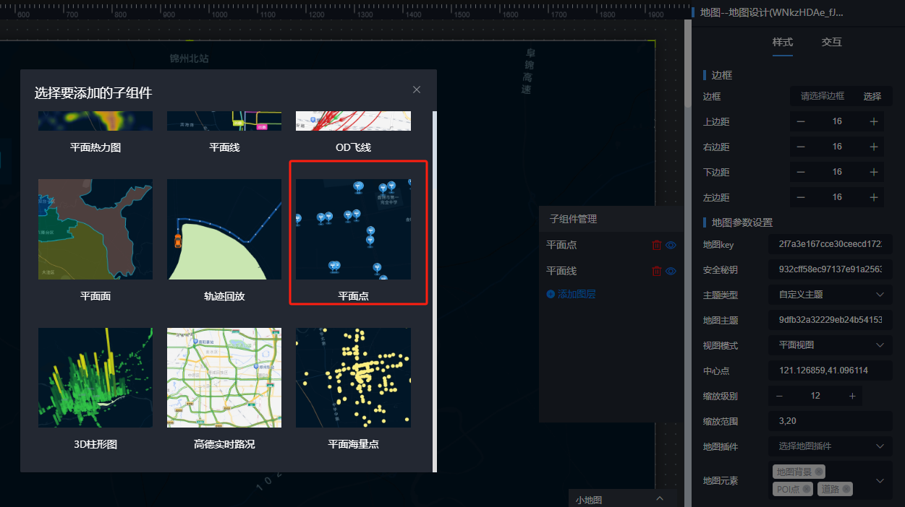
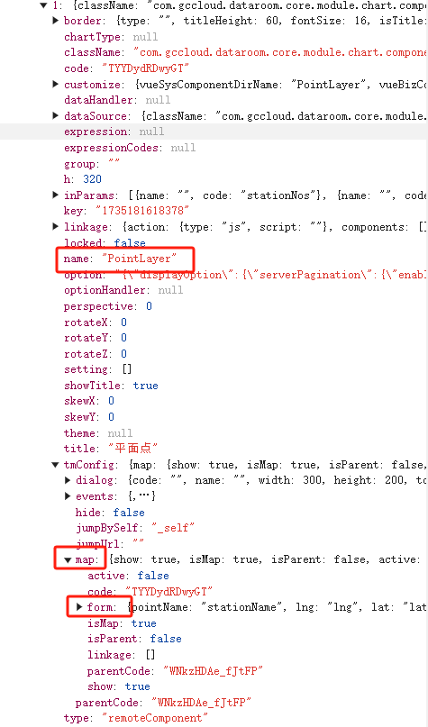
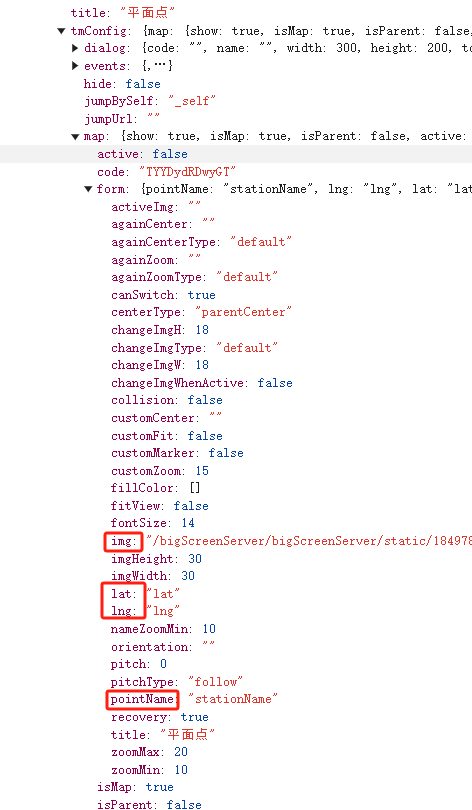
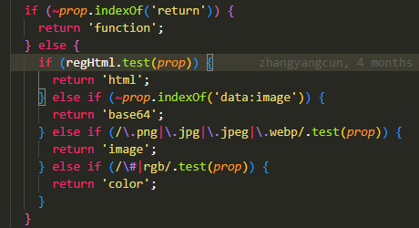
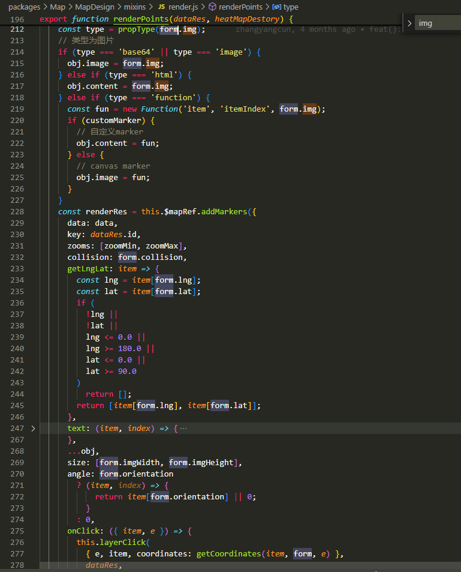

# 平面点图层

最终使用 高德的 LabelsLayer 加 LabelMarker  渲染。 使用 @tiamaes/amap 的 addMarkers 工具函数批量创建

核心配置：

1. config.name：‘PointLayer ’       图层的类型 layerType 是点图

2. 详细图层配置存在 config.tmConfig.map.form 

3. lat，lng 经纬度用数据集的哪个字段， pointName 名称字段

4. img 用来配置 marker 点 的图片，支持多种格式 funtion, html,base64图片，网络image,  #huo或者rgb开头的颜色

   

5.使用 renderPoints 渲染   （packages\Map\MapDesign\mixins\render.js）

