**#**  `@tiamaes/cbb-online-table` **在线表格使用手册**

基于 Vue 的可视化表格设计器, 实现可视化操作生成简单通用的增删改查表格页面.

**特性**

- 基于数据库表生成增删改查表格
- 支持单表，树表，左树右表，主附表（一对一，一对多）
- 数据导出，导入
- 版本管理，版本回退
- 数据权限，数据规则
- 环境迁移（开发环境向生产环境迁移）
- 丰富的表单控件
- 支持表单自定义布局样式
- 代码增强，弹窗插件
- 表单控件注册扩展
- 配套的移动端H5应用

## 使用手册

设计方案管理：

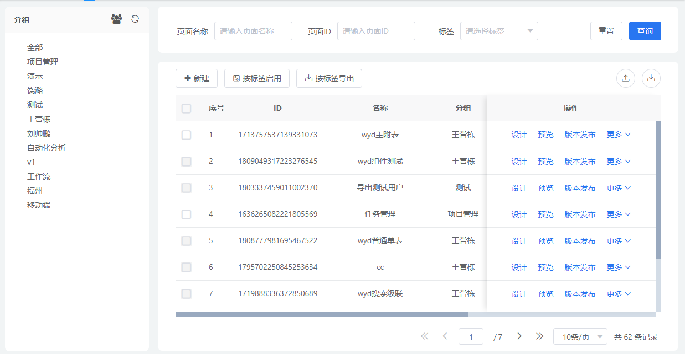

### 新增页面

点击管理页面的新增按钮

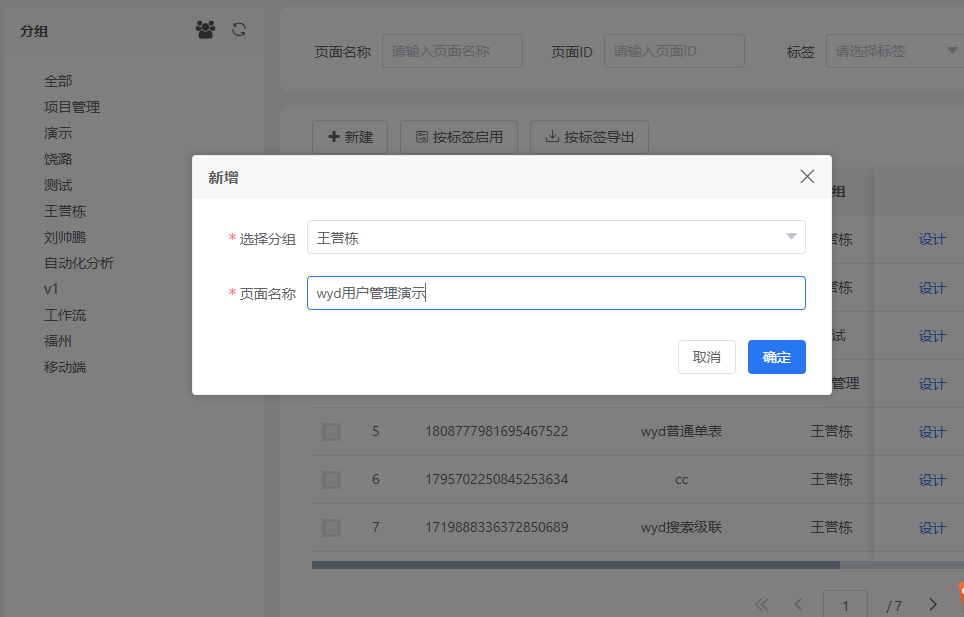

进入设计器的第一个步骤：选择数据库表

1.立刻启用版本： 环境迁移时生效的配置。例如测试环境向生产环境迁移的时候一般是批量迁移（多个页面）。迁移的过程中相当于在生产环境增加了一个新的版本，此配置项控制迁移后是否自动启动测试环境配好的生效版本。 在环境迁移章节会再详细介绍。本案例无需开启

2.启用流程： 搭配工作流使用时开启。开启后，此表格不在具有新增，编辑，删除功能。单行数据将代表的是工作流的流程，设计的表单表示工作流审批中的流程表单。 在工作流章节会详细介绍。本案例无需开启

3.功能说明：功能描述信息。【目前会影响到导出excel的名称】

4.数据连接：数据源选择。数据源列表的来源是数据源管理里的配置。

5.数据表选择：选择数据源后，选择数据库的表。 支持单表，多表。多表时第一个表表示主表，其他的表位附表。

本案例是简单的单表操作：

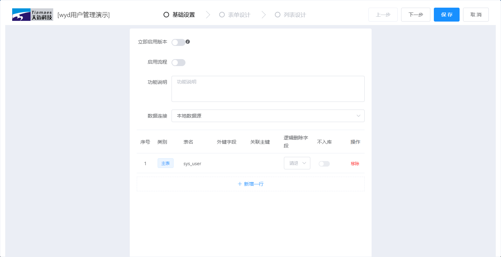

选择表后，进入第二步：设计表单

- 左侧位表单控件：基础控件，高级控件，系统控件，布局控件。 以及用户自行注册的业务扩展控件（后面章节详细介绍）
- 中间是控件画布：左侧控件拖拽到画布，画布可进行拖动排序，布局等操作。
- 右侧是属性配置面板：单个控件属性配置及表单整体属性配置，以及表单代码增强。

右侧展示当前激活的控件的详细可视化配置：

1 组件属性：

1.1 公共配置：

- 唯一标识：随机生成的唯一ID，可用于代码增强里需要获取 ref 组件实例等。
- 数据库表：第一步设计时配置的数据库表。默认时主表，一对一的附表时，可切换为附表
- 控件字段：数据库表配置后，表字段选择。表示要入库的字段。如果是只在前端使用临时字段，可添加新的临时字符，表示虚拟字段不入库（在虚拟字段章节详细介绍）
- 控件名称：表单控件的左侧label

1.2 下方的其他配置，是当前控件特有的配置，不同类型控件拥有不同配置。

已当前的密码字段为例，输入框控件。有站位提示，默认值，前缀，是否是密码，是否制度，校验规则，脚本事件等配置

输入框控件可以通过3个特有的事件触发自定义代码增强脚本，从而于其他控件进行交互。（代码增强后面章节详细介绍，此处暂不操作）

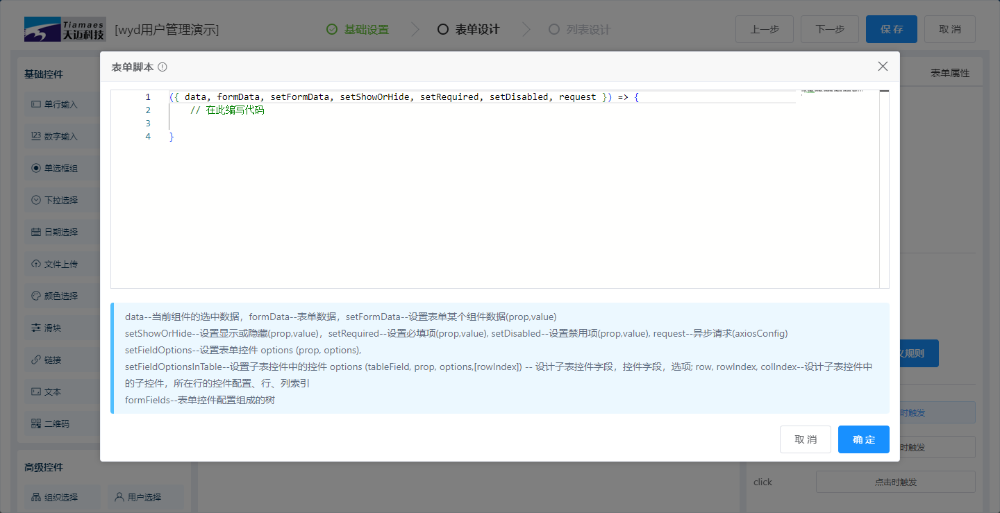

1.3 下拉选择框控件

1.3.1 下拉选择框数据选项配置：

- 静态数据：前端直接配置的静态选项数据，例如男女，等可枚举的固定选项。

  

- 数据字典：动态数据来源（目前动态数据主要通过这种方式）。依赖M1 字典，需要所在项目启用 M1 字典服务。

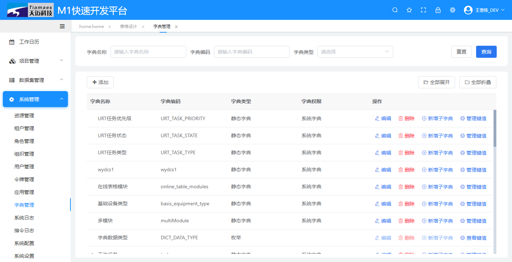

​	字典分为静态字典，动态字典（sql，http接口）

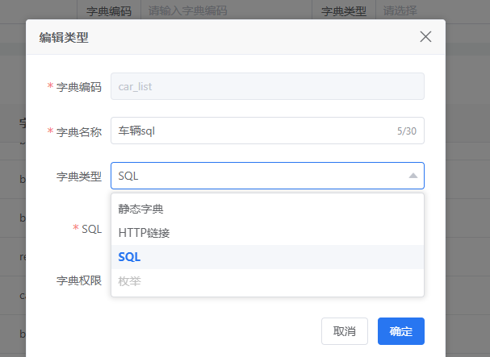

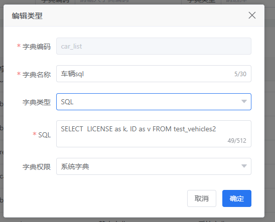

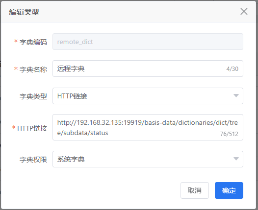

- 其他表格：（实验室功能，开发测试中）从其他在线表格设计的方案里选择字段作为下拉选择数据来源。

  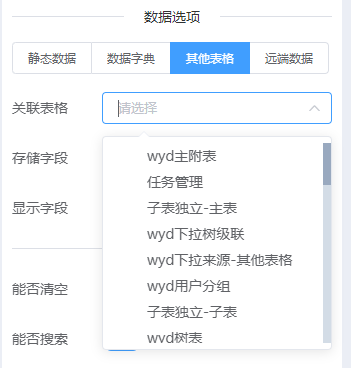

- 远程数据：（实验室功能，开发测试中）类型与postman直接配置接口访问配置，从接口拉取数据。受限于前端ajax跨域，此功能通过后端服务转发。

  

  

  

  1.4 高级控件

  ​	- 组织选择，用户选择，角色选择。 内置完整M1数据权限的数据选择器。

  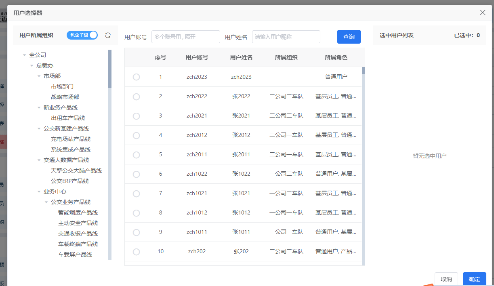

  设计子表，独立子表 都是用于多表主附表操作，在主附表章节详细介绍。

  1.5 系统控件

  系统控件是指无需在前端通过用户手动填写，系统后台自动记录维护的数据。

  创建人员，创建时间，修改人员，修改时间，所属组织。

  1.6 布局控件

  控件容器，可以通过布局控件实现自定义的复杂结构布局，将表单控件拖到布局控件内部。

2 表单属性

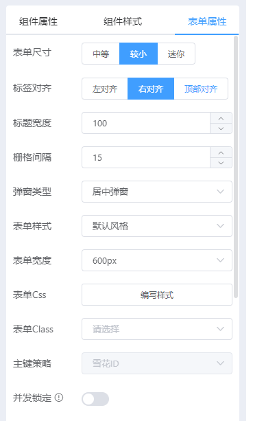

表单弹窗：可选择居中弹窗，右侧弹窗，全屏弹窗 样式

表单按钮：默认是弹窗展示表单，有确认，取消按钮（弹窗底部）。逻辑已内置可不更改。可根据业务配置是否展示。也可新增自定义按钮，实现自定义业务逻辑或者替换自带的确定。

可配置是否开启按钮权限，按钮名称，及按钮代码增强。

权限开启后会在发布到资源菜单后生效。基于M1的权限管理进行分配。

按钮代码增强除了写js脚本外，内置了一些常见的可视化操作。在后面的可视化增强章节详细介绍。

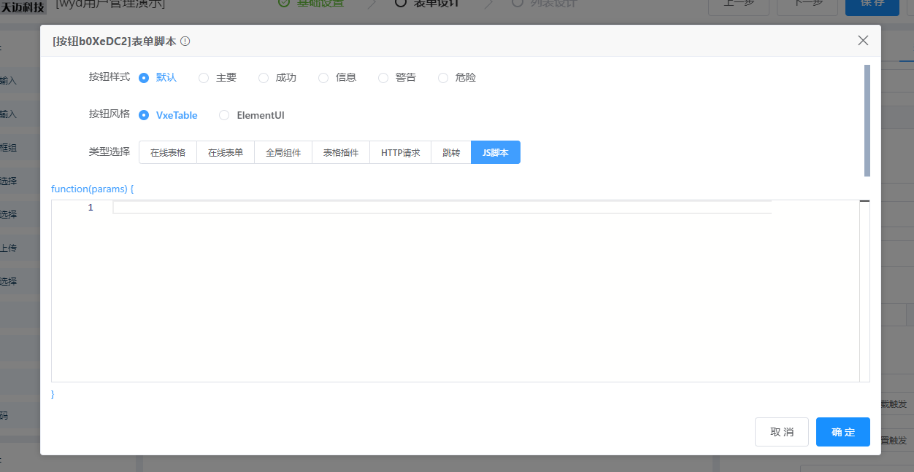

脚本事件：

onLoad： 表单加载后执行。可进行一些表达数据初始化，级联控制等操作。

beforeSubmit: 表单新增/编辑提交数据时触发，可进行数据提交前自定义格式化，数据拦截等操作。注意需返回Promise，resolve会正常走后续内置数据提交入库逻辑。reject 会拦截提交，不在执行后续逻辑，可用此做一些错误拦截等操作。

afterSubmit: 提交后触发。

第三步：列表设计

右侧三项主要配置：

1 查询字段

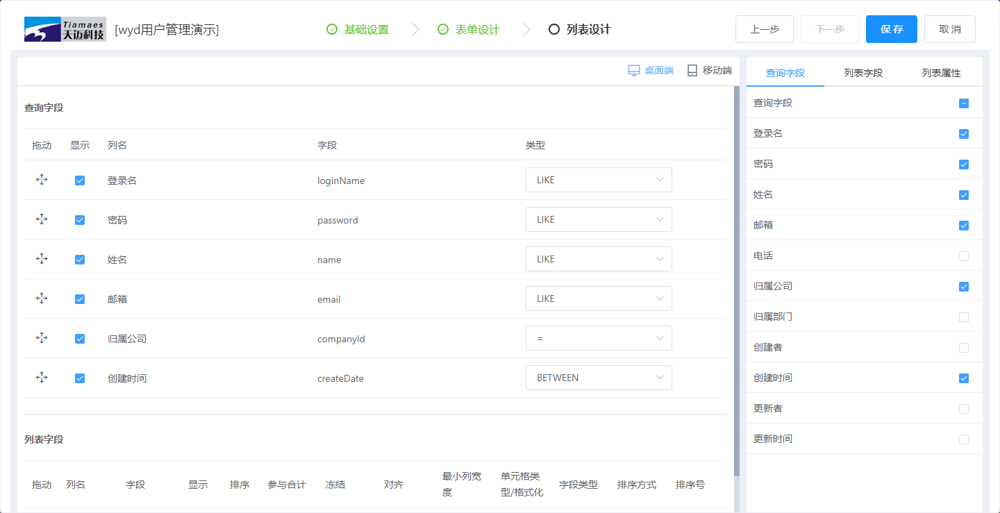

所勾选字段会出现在左侧，可配置查询时匹配类型，输入框类型默认是LIKE，选择框类型默认是=，时间默认是BETWEEN

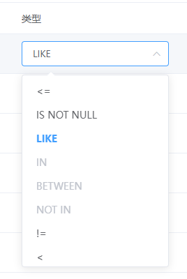

2 列表字段

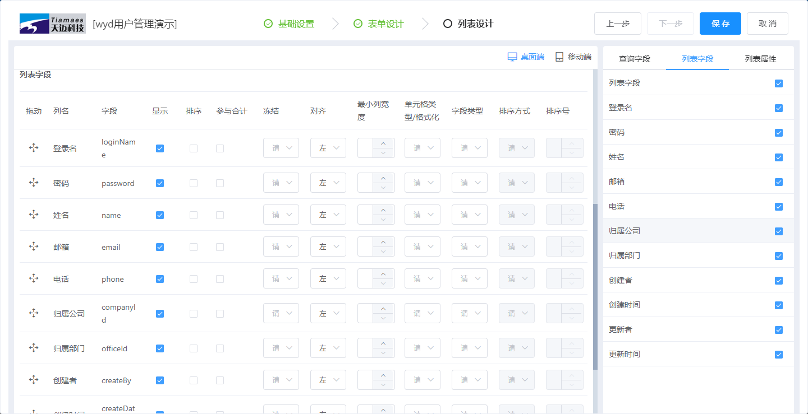

排序：支持正序，倒序。多个字段排序时可通过排序号进行权重设置

合计：数字类型的支持合计，会在表格渲染展示时显示合计（全部数据，不受分页影响）。如只需要当前页合计，可利用前端单页合计功能（后面章节介绍）

冻结：列左固定，右固定。 内置序号列左固定，操作栏右固定

单元格类型/格式化: 内置了常见类型的内容渲染格式。图片直接渲染成img标签，链接渲染会超级链接。HTML当做富文本渲染。以及时间格式化

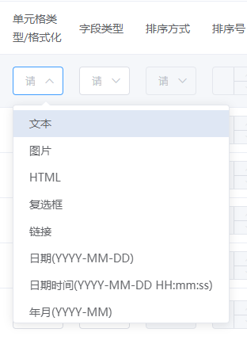

字段类型：表明后端服务字段类型。例如不能重复可设计值为编号（ID）

3 列表属性

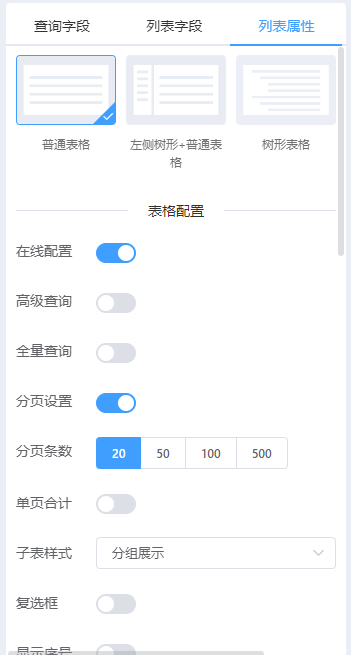

3.1 展示样式

- 普通表格（常见的单表）

  

- 左树右表（常用于左侧是分组，右侧是列表）

  

- 树表 （常见的有父子关系，id，pid的树形表格）

3.1.1 左侧树形+普通表格

当选择左树右表布局时，需要进行左树配置。

数据来源支持3种：

- 数据字段：依赖M1字段服务，上同下拉选择数据来源字段配置。可以选择父子字典，渲染为树

  

- 组织数据：M1内置的组织架构，类似于用户管理页面左侧的M1组织树

- 在线表格：其他在线表格设计的单表类型的表格（单表，树表。不能选择主附表作为左树来源）

  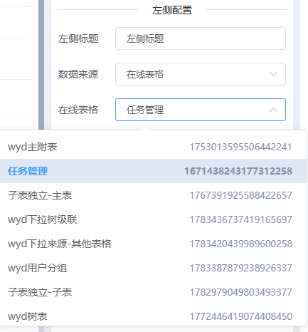

  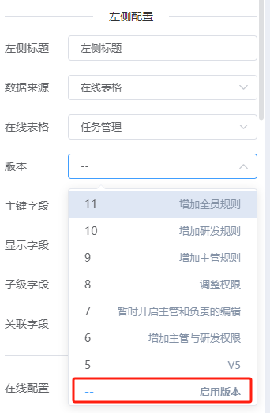

  版本一般不选择，使用当前启用版本，这样当依赖的页面发送变动发布新版本时，这里的左树自动使用最新版依赖的页面。

  

  3.1.1.2 关联字段配置：

  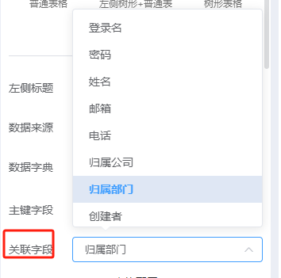

  左树右表中的左树，是作为右边列表的搜索条件进行查询检索的。所需需要绑定一个字段，对此字段进行过滤查询。

  

  3.1.2 表格配置

  - 在线配置：开启后，管理员（开发者）可在预览页面进行列字段和搜索条件的在线启用配置，无需重新设计

  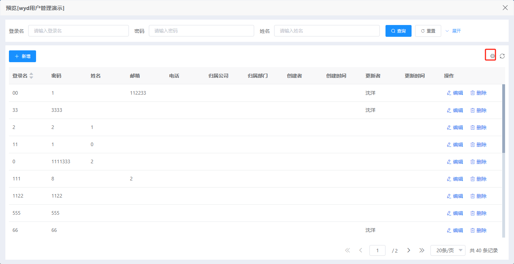

  

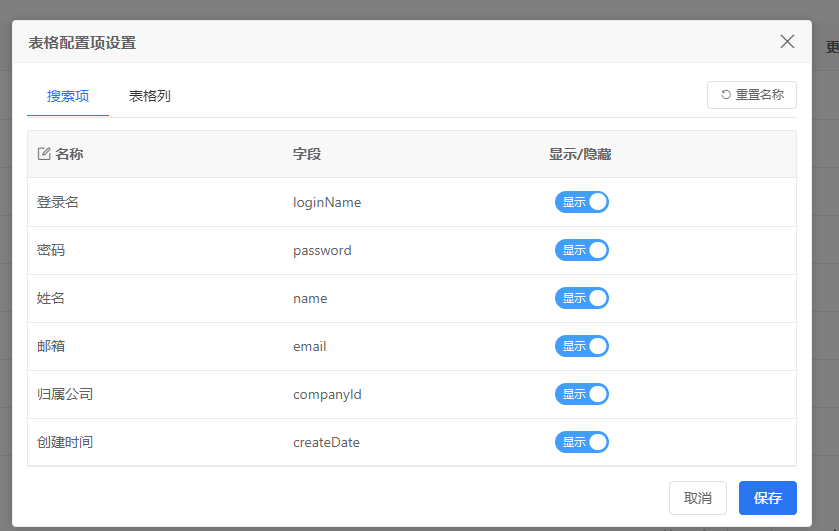

- 高级查询：开启后，表格预览页面会出现高级综合查询

  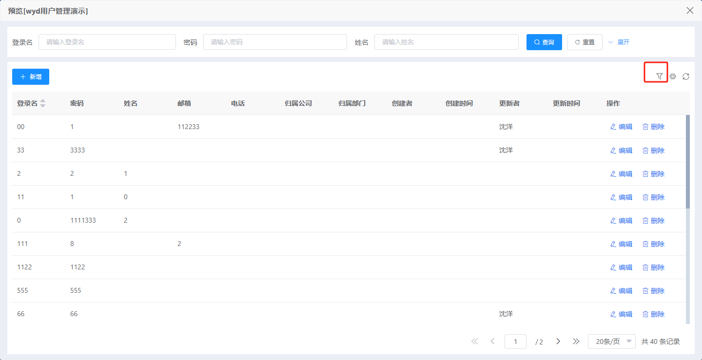

  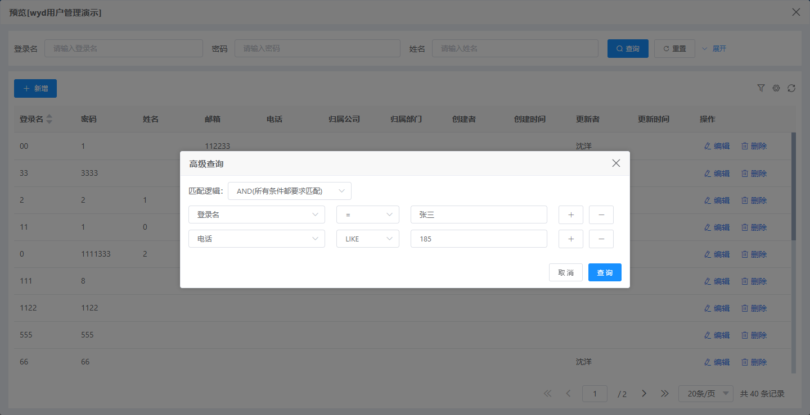

- 全量查询：开启后，表格预览时不分页，展示全量数据长列表。（支持大数据量数据虚拟滚动，无需担心卡顿）

- 分页设置：开启后，表格预览时可以选择分页大小

  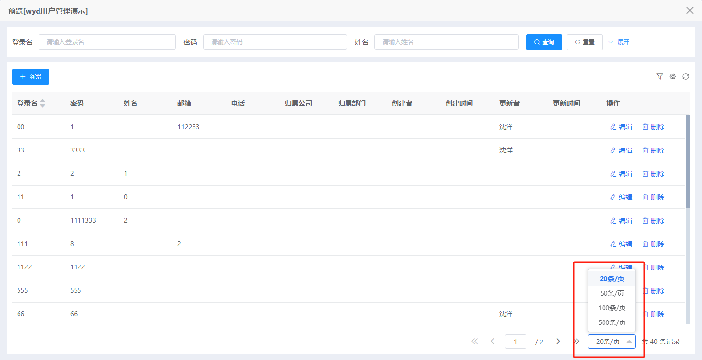

  

- 子表样式：主附表时生效，子表在表格预览时的展示样式

  - 分组展示：附表字段也展示在列表列

    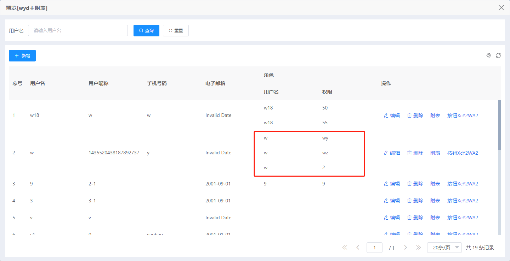

  - 折叠展示：附表会在主表展开折叠面板里展示

    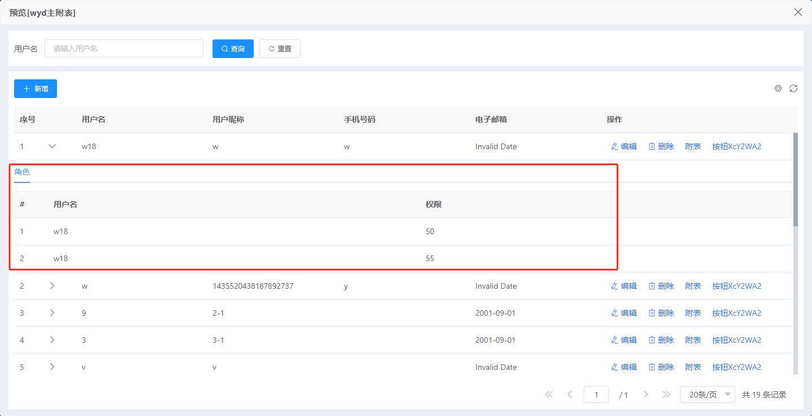

- 复选框：开启后，表格展示时左侧会有复选框，通常搭配工具栏自定义按钮进行业务增强使用。

  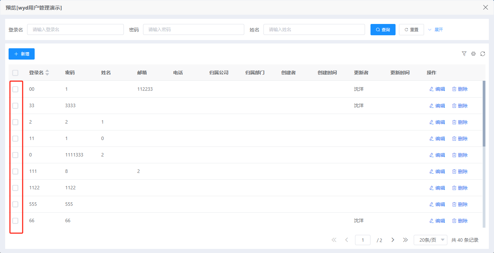

- 展示序号：开启后，表格预览时左侧展示序号列

  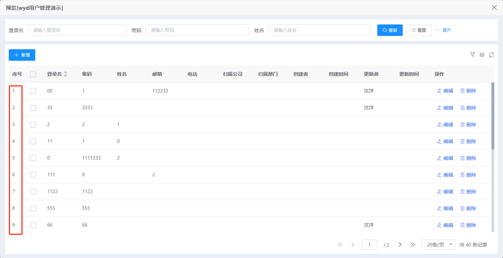

  序号支持翻页后累加

  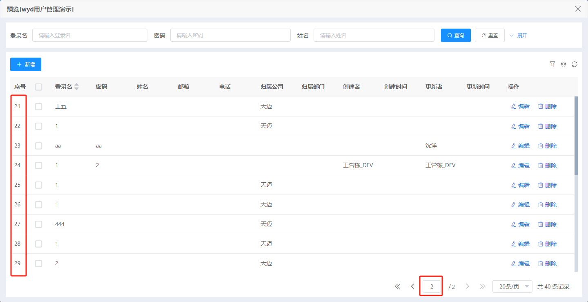

- 隐藏操作栏： 数据只是展示时，可以把操作栏隐藏

  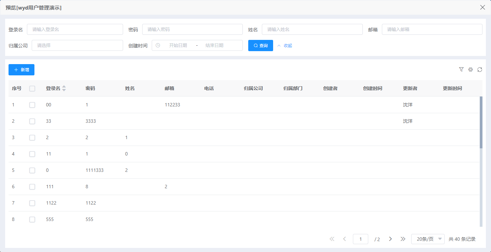

- 隐藏重置按钮： 搜索栏的重置按钮可以不展示

  

3.1.3 按钮配置

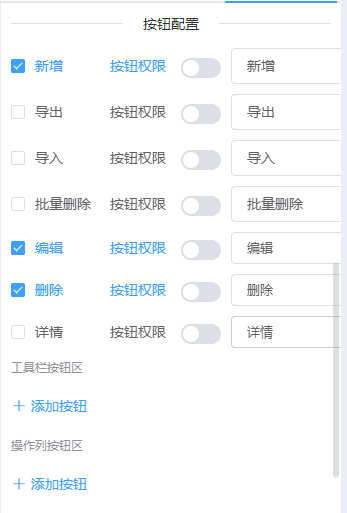

内置有 新增，编辑，删除，详情，批量删除，导入，导出功能。可根据业务需要开启隐藏，也可开始按钮权限（同上基于M1菜单按钮权限规则），重名名。

导出可进行字段设置：

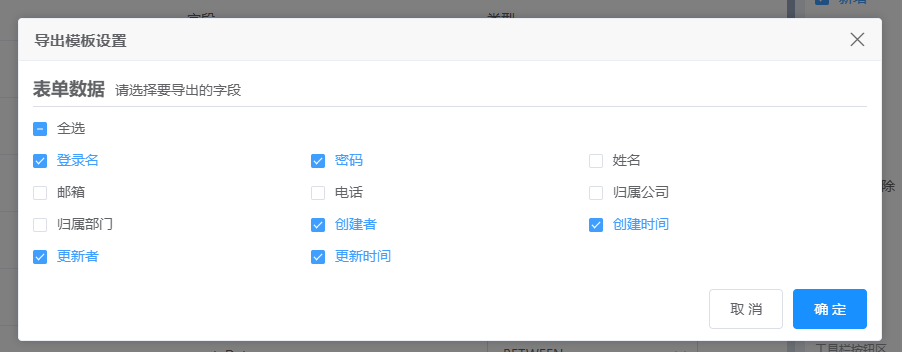

自定义按钮增强：

- 工具栏按钮

- 操作列按钮

  

  

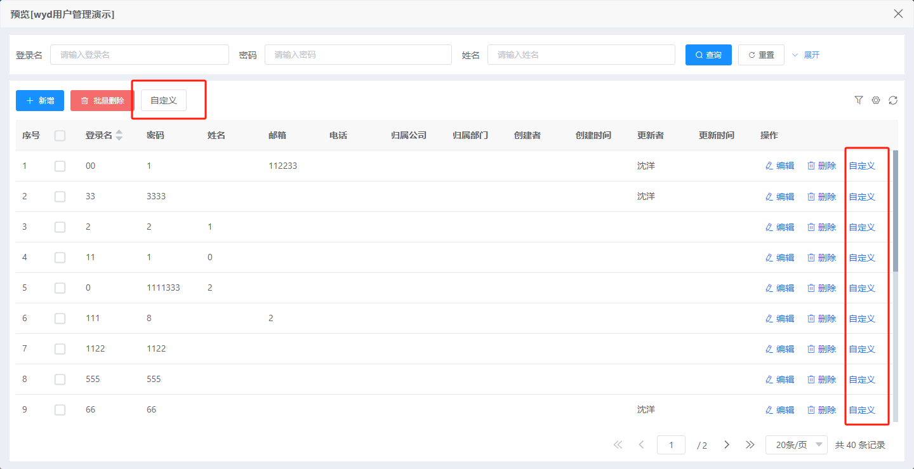

3.1.4 后台服务增强

## 数据权限

通过建立 数据规则 与 规则授权 的方式实现数据权限管理。

#### 新增数据规则

数据规则是针对已设计完成的表格页面的数据源(表), 控制数据是否要展示给用户的过滤条件

点击新增按钮, 表单中输入规则名称, 选择规则类型, 规则字段, 规则, 规则值等.

新增成功后, 列表更新.

![img]()

*同步版本时, 数据规则跟启用版本绑定. 即使设计版本中数据规则被删除, 历史版本中的数据规则都不会受影响*

编辑和删除没有特殊之处, 不再说明

## [#](https://indint.tiamaes.com/docs/ve/npm/tableGenerator/表格设计器使用手册.html#授权)授权

管理列表 -- 更多 -- 授权, 打开授权界面

左侧为角色组织用户选择器, 右侧为当前启用版本的数据规则列表.

用户[天迈科技]未应用任何数据规则, 可以看到表的所有数据

在授权界面为[天迈科技]用户应用数据规则[USERNAME 等于 111]

[天迈科技]用户再次访问页面时, 只能看到用户名是 111 的数据.

## 发布路由

管理页面 -- 操作 -- 更多 -- 发布路由

表单字段说明:

- 资源名称: 默认为页面名称, 可以修改
- 上级菜单: 非必填, 要添加到哪个菜单下
- 访问路径: 会自动生成一个唯一路径, 可以手动修改, 但要注意唯一
- 备注: 非必填