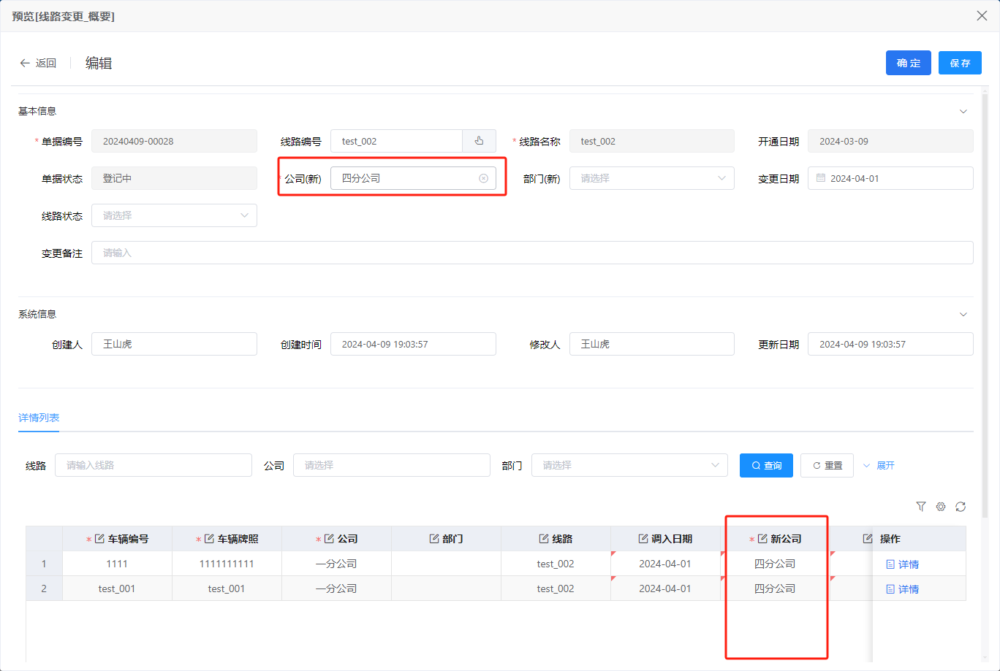

# 子表独立

mainParameter

WebxTableSelf

```
tag: "webx-TableSelf"
type: "table"
widgetKey: "tableSelf"
relationField: "username"
tableSelfPageId: "1745018588161826817"
```


###  主表操作子表

1.主表的某个下拉框发生change， 更新子表所有行数据的某个字段

（主表的公司字段更新了，把子表的所有公司字段都改了）




```javascript
    /* 为子表中所有的公司赋值 */
    var moveDetailGrid = params.getTableWidgetRef('41h-It'); // 拿到子表
    var resData = moveDetailGrid.getTableData(); // 子表数据数组
    var newOrganNo = params.formData.newOrganNo; // 主表公司字段的新值
    this.$modal.confirm(this.$t('确定要更新子表数据吗')).then(type => {
        if (type == 'confirm') {
            if (resData) {
                for (var i = 0; i < resData.length; i++) {
                    var dataTemp = resData[i];
                    dataTemp.newOrganNo = newOrganNo;
                }
            }
        }
    });
```


2.