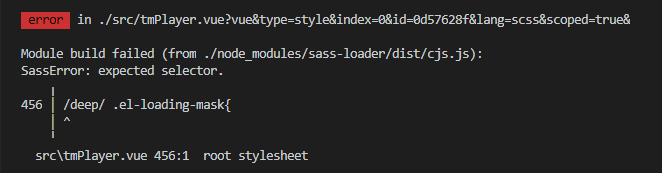

# 报错内容：
```
 error  in ./src/tmPlayer.vue?vue&type=style&index=0&id=0d57628f&lang=scss&scoped=true&

Module build failed (from ./node_modules/sass-loader/dist/cjs.js):
SassError: expected selector.
    ╷
456 │ /deep/ .el-loading-mask{
    │ ^
    ╵
  src\tmPlayer.vue 456:1  root stylesheet
```




# 解决

尝试用 ::v-deep 替换 /deep/ ，成功解决了问题。

某些预处理器（例如Sass）可能无法>>>正确解析。

在这些情况下，可以用/deep/

如果/deep/报错，可以使用::v-deep

组合器-两者都是它们的别名，>>> 并且工作原理完全相同。

用法和/deep/ 完全一样

[参考链接](https://www.jianshu.com/p/cc06f2ee7fb6)