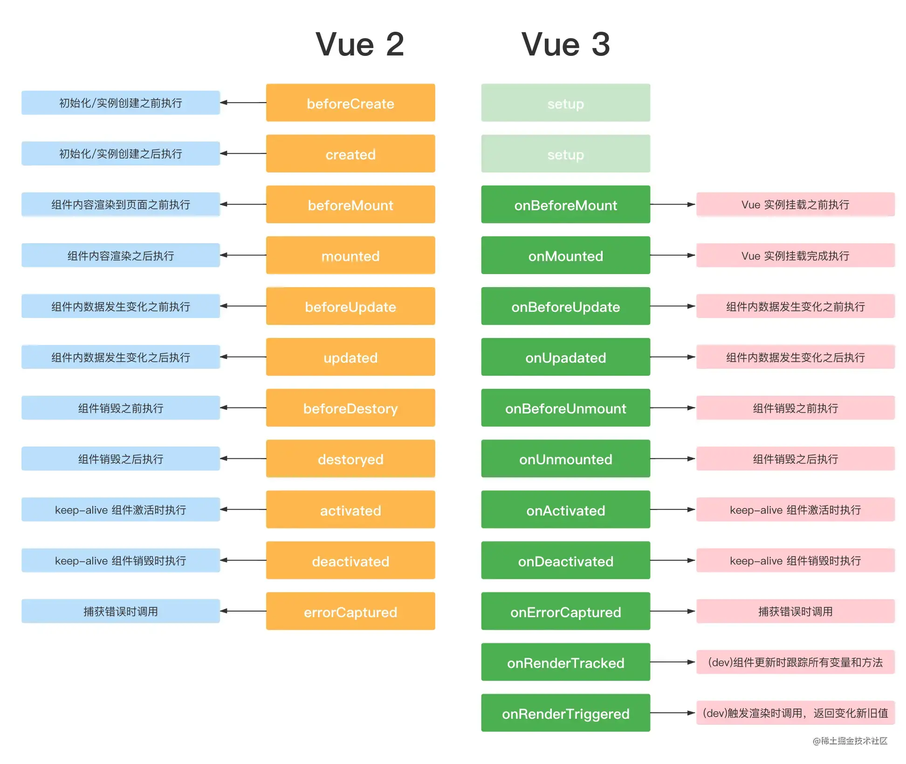

# 生命周期

和 vue2 相比的话，基本上就是将 Vue2 中的beforeDestroy名称变更成beforeUnmount; 

destroyed 表更为 unmounted；

然后用setup代替了两个钩子函数 beforeCreate 和 created；

新增了两个开发环境用于调试的钩子




# vue2和vue3生命周期对比

```
beforeCreate  -> 使用 setup()
created       -> 使用 setup()
beforeMount   -> onBeforeMount
mounted       -> onMounted
beforeUpdate  -> onBeforeUpdate
updated       -> onUpdated
beforeDestroy -> onBeforeUnmount
destroyed     -> onUnmounted
errorCaptured -> onErrorCaptured

```

```js
<template>
  <div class="home">
    <p>{{ count }}</p>
    <p>{{ state.a }}</p>
    <button @click="add">加1</button>
  </div>
</template>

<script lang="ts" setup>
import {
  ref,
  reactive,
  onBeforeMount,
  onMounted,
  onBeforeUpdate,
  onUpdated,
  onBeforeUnmount,
  onUnmounted,
  onErrorCaptured,
  onRenderTracked,
  onRenderTriggered,
  onActivated,
  onDeactivated,
} from "vue";
const count = ref(1);
const state = reactive({ a: 10 });
const add = () => {
  count.value += 1;
  state.a = state.a + 1;
};

onBeforeMount(() => {
  console.log("onBeforeMount");
});
onMounted(() => {
  console.log("onMounted");
});

onBeforeUpdate(() => {
  console.log("onBeforeUpdate");
});

onUpdated(() => {
  console.log("onUpdated");
});

onBeforeUnmount(() => {
  console.log("onBeforeUnmount");
});

onUnmounted(() => {
  console.log("onUnmounted");
});

onErrorCaptured((evt) => {
  console.log("onErrorCaptured", evt);
});

// 只执行一次,有几个响应式api,执行几次
onRenderTracked((evt) => {
  console.log("onRenderTracked", evt);
});

// 行为如同onUpdated,每次有数据更新都会执行
onRenderTriggered((evt) => {
  console.log("onRenderTriggered", evt);
});

// keep-alive要用到的函数
onActivated(() => {
  console.log("onActivated");
});

onDeactivated(() => {
  console.log("onDeactivated");
});
</script>

```