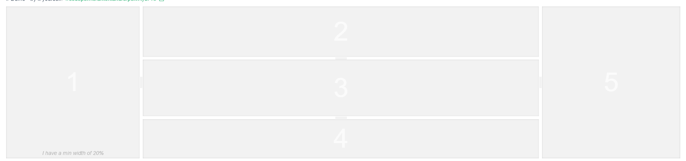

[npm](https://www.npmjs.com/package/splitpanes)
[github](https://github.com/antoniandre/splitpanes)
[demo](https://antoniandre.github.io/splitpanes/)


# splitpanes 

切割面板组件，拖动分割线可改变面板宽度




# 安装

```
npm i --S splitpanes
```


# 引入

```
// In your VueJS component.
import { Splitpanes, Pane } from 'splitpanes'
import 'splitpanes/dist/splitpanes.css'

export default {
  components: { Splitpanes, Pane },
  ...
}
```


# 使用

```
<splitpanes class="default-theme" horizontal style="height: 400px">
  <pane min-size="20" max-size="70">
    <span>1</span>
  </pane>
  <pane>
    <span>2</span>
  </pane>
  <pane max-size="70">
    <span>3</span>
  </pane>
</splitpanes>
```

上面代码将展示一个被水平分割线分离的3个面板


# 属性

splitpanes 属性
```
    horizontal: { type: Boolean, default: false },		  // 是否为水平分割，默认为垂直分割
    pushOtherPanes: { type: Boolean, default: true },
    dblClickSplitter: { type: Boolean, default: true },
    firstSplitter: { type: Boolean, default: false }
```

pane 属性
```
    size: { type: [Number, String], default: null },	 // 大小，可为数字，字符串，数字表示百分比，字符串表示px
    minSize: { type: [Number, String], default: 0 },	// 最小占比
    maxSize: { type: [Number, String], default: 100 }   // 最大占比
```