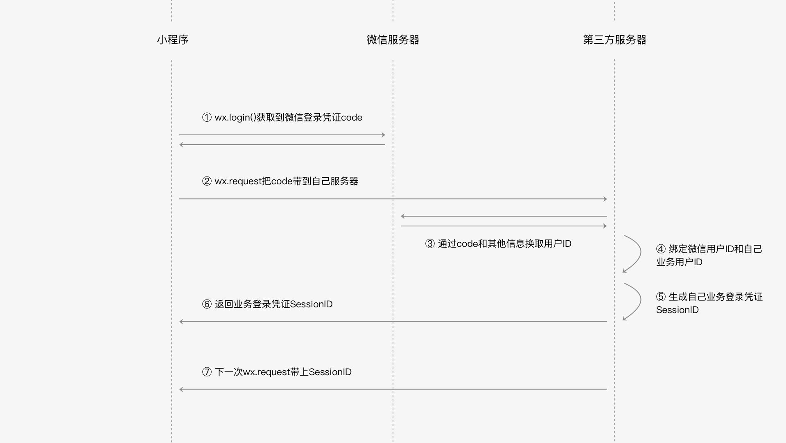

[微信登录](https://developers.weixin.qq.com/ebook?action=get_post_info&docid=000cc48f96c5989b0086ddc7e56c0a#_ftn7)


# 微信登录

已有的互联网产品在接入小程序会面临一些和登录态相关的问题：怎么获取微信登录态；怎么把微信帐号和自己的帐号进行打通。





# 获取微信登录凭证code

首先说到登录，我们可能很正常地想到一个做法：通过wx.login直接拿到微信用户的id编号，再把这个id传到自己的后台，从而知道是哪个微信用户在使用我的服务。

而我们上述微信登录的流程中并不是通过wx.login直接获取微信用户的id，那直接获取微信用户id的做法有什么问题呢？ 

假设现在我们有个接口，通过wx.request请求 https://test.com/getUserInfo?id=1 拉取到微信用户id为1在我们业务侧的个人信息，

那么黑客就可以通过遍历所有的id，把整个业务侧的个人信息数据全部拉走，如果我们还有其他接口也是依赖这样的方式去实现的话，

那黑客就可以伪装成任意身份来操作任意账户下的数据，想想这给业务带来多大的安全风险。

为了避免这样的风险，wx.login是生成一个带有时效性的凭证，就像是一个会过期的临时身份证一样，

在wx.login调用时，会先在微信后台生成一张临时的身份证，其有效时间仅为5分钟。

然后把这个临时身份证返回给小程序方，这个临时的身份证我们把它称为微信登录凭证code。

如果5分钟内小程序的后台不拿着这个临时身份证来微信后台服务器换取微信用户id的话，那么这个身份证就会被作废，

需要再调用wx.login重新生成登录凭证。

由于这个临时身份证5分钟后会过期，如果黑客要冒充一个用户的话，那他就必须在5分钟内穷举所有的身份证id，

然后去开发者服务器换取真实的用户身份。

显然，黑客要付出非常大的成本才能获取到一个用户信息，

同时，开发者服务器也可以通过一些技术手段检测到5分钟内频繁从某个ip发送过来的登录请求，从而拒绝掉这些请求。


# 发送code到开发者服务器

在wx.login的success回调中拿到微信登录凭证，紧接着会通过wx.request把code传到开发者服务器，为了后续可以换取微信用户身份id。

如果当前微信用户还没有绑定当前小程序业务的用户身份，那在这次请求应该顺便把用户输入的帐号密码一起传到后台，

然后开发者服务器就可以校验账号密码之后再和微信用户id进行绑定，小程序端的示例代码如下所示。

```
Page({
  tapLogin: function() {
    wx.login({
      success: function(res) {
        if (res.code) {
          wx.request({
            url: 'https://test.com/login',
            data: {
              username: 'zhangsan', // 用户输入的账号
              password: 'pwd123456', // 用户输入的密码
              code: res.code
            },
            success: function(res) {
              // 登录成功
              if (res.statusCode === 200) {
               console.log(res.data.sessionId)// 服务器回包内容
              }
            }
          })
        } else {
          console.log('获取用户登录态失败！' + res.errMsg)
        }
      }
    });
  }
})
```


# 到微信服务器换取微信用户身份id

到了第3步，开发者的后台就拿到了前边wx.login()所生成的微信登录凭证code，此时就可以拿这个code到微信服务器换取微信用户身份。

微信服务器为了确保拿code过来换取身份信息的人就是刚刚对应的小程序开发者，到微信服务器的请求要同时带上AppId和AppSecret，

这两个信息在小程序管理平台的开发设置界面可以看到，

由此可以看出，AppId和AppSecret是微信鉴别开发者身份的重要信息，AppId是公开信息，泄露AppId不会带来安全风险，

但是AppSecret是开发者的隐私数据不应该泄露，如果发现泄露需要到小程序管理平台进行重置AppSecret，

而code在成功换取一次信息之后也会立即失效，即便凭证code生成时间还没过期。


开发者服务器和微信服务器通信也是通过HTTPS协议，微信服务器提供的接口地址是：
```
https://api.weixin.qq.com/sns/jscode2session?appid=<AppId>&secret=<AppSecret>&js_code=<code>&grant_type=authorization_code
```

URL的query部分的参数中 <AppId>, <AppSecret>, <code> 就是前文所提到的三个信息，请求参数合法的话，接口会返回以下字段。

```
jscode2session接口返回字段

字段			描述
openid			微信用户的唯一标识
session_key		会话密钥
unionid			用户在微信开放平台的唯一标识符。本字段在满足一定条件的情况下才返回。
```

我们暂时只要关注前两个字段即可，openid就是前文一直提到的微信用户id，可以用这个id来区分不同的微信用户。

session_key则是微信服务器给开发者服务器颁发的身份凭证，开发者可以用session_key请求微信服务器其他接口来获取一些其他信息，

由此可以看到，session_key不应该泄露或者下发到小程序前端。

可能我们会好奇为什么要设计session_key，如果我们每次都通过小程序前端wx.login()生成微信登录凭证code去微信服务器请求信息，

步骤太多造成整体耗时比较严重，因此对于一个比较可信的服务端，给开发者服务器颁发一个时效性更长的会话密钥就显得很有必要了。

session_key也存在过期时间，因为篇幅关系，我们不在此展开，可以参考小程序的官方文档关于session_key的相关介绍。


# 绑定微信用户身份id和业务用户身份

业务侧用户还没绑定微信侧身份时，会让用户填写业务侧的用户名密码，这两个值会和微信登录凭证一起请求开发者服务器的登录接口，

此时开发者后台通过校验用户名密码就拿到了业务侧的用户身份id，通过code到微信服务器获取微信侧的用户身份openid。

微信会建议开发者把这两个信息的对应关系存起来，我们把这个对应关系称之为“绑定”。

有了这个绑定信息，小程序在下次需要用户登录的时候就可以不需要输入账号密码，

因为通过wx.login()获取到code之后，可以拿到用户的微信身份openid，通过绑定信息就可以查出业务侧的用户身份id，这样静默授权的登录方式显得非常便捷。


