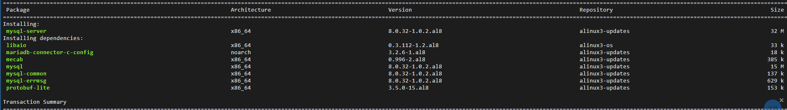

ECS云服务器

操作系统：Alibaba Cloud Linux 3.2104 LTS 64位

公网IP：47.92.160.141

配置： **2**核(vCPU) **2** G 公网带宽 3 Mbps

价格： 99/年

账号密码：root    alyP@SSw0rd


#### 安装nginx

```
yum update && yum -y install nginx
```

启动

```
systemctl start nginx
```


#### 安装MySQL服务器

```
yum install mysql-server
```




安装完成后，启动MySQL服务：

```
systemctl start mysqld
```

为了确保MySQL在系统启动时自动启动，使用以下命令来启用：

```
systemctl enable mysqld
```

安全设置MySQL，包括设置root密码和删除匿名用户：

```
mysql_secure_installation
```

如果您需要登录到MySQL，可以使用以下命令：

```
mysql -u root -p
```

