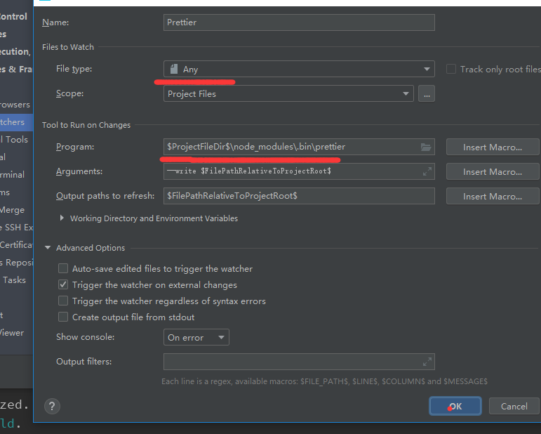

[官网详细配置项](https://prettier.io/docs/en/options.html)


# Prettier

目前前端使用最广泛的格式化代码工具, 它可以支持JS/JSX/TS/Flow/JSON/CSS/LESS等文件格式。


# 为什么要用Prettier

用来替代lint中的一些场景，比如说分号/tab缩进/空格/引号，这些在lint工具检查出问题之后还需要手动修改，

而通常这样的错误都是空格或者符号之类的，这样相对来说不太优雅，利用格式化工具自动生成省时省力。

# 如何自定义配置

Prettier提供了一套默认的配置，那么如何修改配置项符合我们自己的代码规范呢，有三种方法可以做到

[配置文件支持的格式](https://prettier.io/docs/en/configuration.html)

- .prettierrc 文件(使用 json 格式)
- prettier.config.js 文件
- package.json 中配置prettier属性


在根目录下新建 .prettierrc 文件，用于配置 Prettier 进行代码格式化的规则
```
{
  "printWidth": 80, 		//一行的字符数，如果超过会进行换行，默认为80
  "tabWidth": 2, 			//一个tab代表几个空格数，默认为2
  "useTabs": false, 		//是否使用tab进行缩进，默认为false，表示用空格进行缩减
  "singleQuote": false, 	//字符串是否使用单引号，默认为false，使用双引号
  "semi": true, 			//行尾是否使用分号，默认为true
  "trailingComma": "none", 	//是否使用尾逗号，[a,b,c,d,] 有三个可选值"<none|es5|all>"
  "bracketSpacing": true, 	//对象大括号之间是否有空格，默认为true，效果：{ foo: bar }
  "arrowParens": "avoid",	// 箭头函数是否有参数括号，默认avoid,可选 avoid| always, avoid能省略括号的时候就省略 x => x, always总是有括号(x) => x
  "parser": "babel" 		//代码的解析引擎。
}
```

各编辑器请自行安装相关插件，


# 忽略项

要排除文件格式，请.prettierignore在项目根目录中的文件中添加条目

.prettierignore 使用 .gitignore 语法。

# 编辑器设置 Prettier

## Webstorm
Webstorm 内置了 Prettier 插件不需要安装

设置保存时自动格式化：

使用File Watcher在保存时运行Prettier

`file->settings->Tools->File Watchers->+->Prettier`



保存配置就行了  后面写了东西再保存就会自动格式化了


## VSCode

安装以下插件
```
Prettier - Code formatter
```